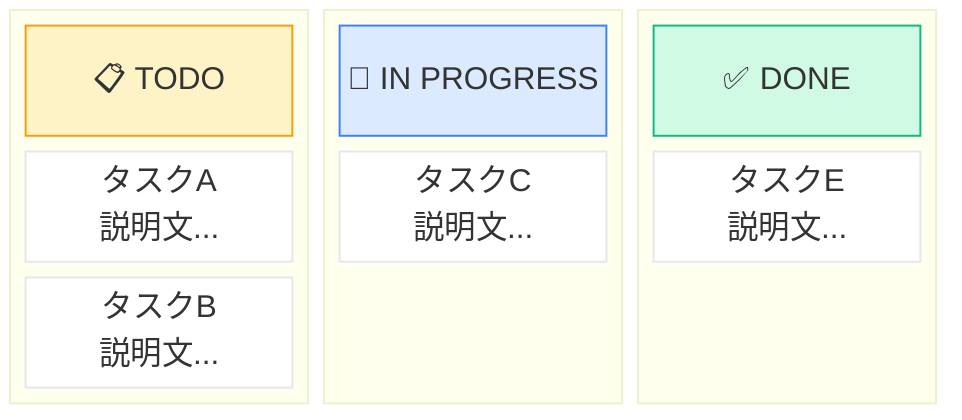
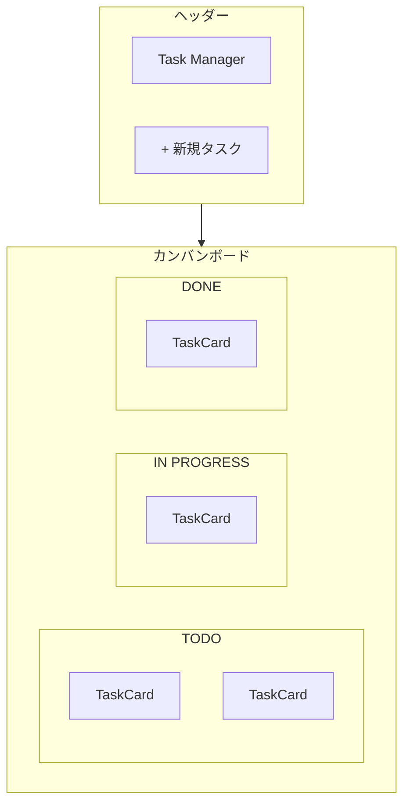

# Next.js学習ロードマップ

## このロードマップについて

- **対象者**: React経験者でNext.js初心者
- **最終成果物**: Jira風タスク管理ツール（カンバンボード）

## 成果物イメージ



### 画面構成



## 技術スタック

| カテゴリ | 技術 | 用途 |
|---------|------|------|
| フレームワーク | Next.js 14 (App Router) | Reactベースのフルスタックフレームワーク |
| 言語 | TypeScript | 型安全な開発 |
| スタイリング | Tailwind CSS | ユーティリティファーストCSS |
| DB | SQLite + Prisma | ローカルDB + ORM |
| デプロイ | Vercel | Next.js公式のホスティング |

## ロードマップ構成

### 必須編（Phase 1-4）

ここまで完了すれば、動くタスク管理アプリが完成します。

| Phase | テーマ | 学ぶこと | 成果物 |
|-------|--------|----------|--------|
| 1 | 基礎編 | App Router, ルーティング, SC/CC | ページの骨組み |
| 2 | UI構築編 | コンポーネント設計, Props, Tailwind | カンバンボードUI |
| 3 | データ操作編 | useState, フォーム, Server Actions | タスク追加/削除 |
| 4 | 完成編 | Prisma, CRUD, デプロイ | 完成アプリ |

### 発展編（Optional）

必須編を終えた人向けのチャレンジ課題です。

| 課題 | 内容 | 難易度 |
|------|------|--------|
| ドラッグ&ドロップ | dnd-kitでカンバン操作 | ★★★ |
| 認証機能 | NextAuth.jsでログイン | ★★ |
| 楽観的更新 | useOptimisticで高速UX | ★★★ |
| ダークモード | CSS変数でテーマ切替 | ★ |

## 環境構築

### 1. プロジェクト作成

```bash
npx create-next-app@latest task-manager
```

### 2. 質問への回答

```
✔ Would you like to use TypeScript? … Yes
✔ Would you like to use ESLint? … Yes
✔ Would you like to use Tailwind CSS? … Yes
✔ Would you like your code inside a `src/` directory? … No
✔ Would you like to use App Router? (recommended) … Yes
✔ Would you like to use Turbopack for `next dev`? … Yes
✔ Would you like to customize the import alias (@/* by default)? … No
```

### 3. 開発サーバー起動

```bash
cd task-manager
npm run dev
```

http://localhost:3000 にアクセスして、Next.jsのウェルカムページが表示されればOK。

## ディレクトリ構成（最終形）

```
task-manager/
├── app/
│   ├── layout.tsx          # 共通レイアウト
│   ├── page.tsx            # トップページ
│   ├── globals.css         # グローバルCSS
│   └── tasks/
│       └── page.tsx        # タスク一覧ページ
├── components/
│   ├── Header.tsx          # ヘッダー
│   ├── TaskCard.tsx        # タスクカード
│   ├── TaskList.tsx        # タスクリスト
│   ├── StatusColumn.tsx    # ステータス列
│   ├── TaskBoard.tsx       # カンバンボード
│   └── AddTaskForm.tsx     # タスク追加フォーム
├── lib/
│   ├── actions.ts          # Server Actions
│   └── prisma.ts           # Prismaクライアント
├── prisma/
│   ├── schema.prisma       # DBスキーマ
│   └── dev.db              # SQLiteデータベース
├── types/
│   └── task.ts             # 型定義
├── package.json
├── tailwind.config.ts
└── tsconfig.json
```

## 進め方のコツ

1. **必ず手を動かしながら進める**
   - コードをコピペした後、自分で少し変更してみる
   - 「なぜ動くのか」を考えながら進める

2. **エラーが出たら「つまずきポイント」を確認**
   - 各Stepによくあるエラーと解決法を記載しています
   - エラーメッセージをよく読む習慣をつける

3. **各Phaseの完了チェックリストを全部埋めてから次へ**
   - 理解があやふやなまま進まない
   - 分からない部分は公式ドキュメントも参照

4. **発展編は興味のあるものだけでOK**
   - 必須編だけで十分実用的なアプリが完成します
   - 余裕があれば挑戦してみてください

## ファイル一覧

- [README.md](./README.md) - このファイル（全体概要）
- [phase1.md](./phase1.md) - 基礎編：Next.jsの基本を理解する
- [phase2.md](./phase2.md) - UI構築編：コンポーネントでUIを作る
- [phase3.md](./phase3.md) - データ操作編：状態管理とServer Actions
- [phase4.md](./phase4.md) - 完成編：CRUD実装とデプロイ
- [optional.md](./optional.md) - 発展課題集（やりたい人だけ）

---

それでは、[Phase 1](./phase1.md) から始めましょう！
