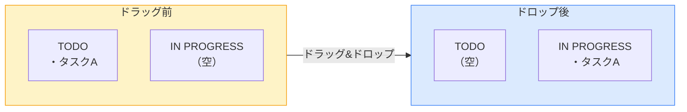
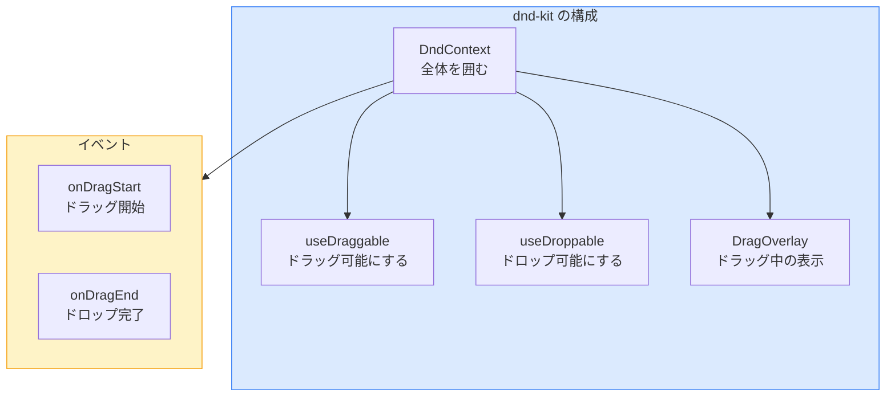
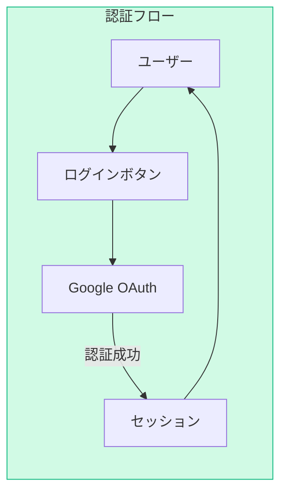
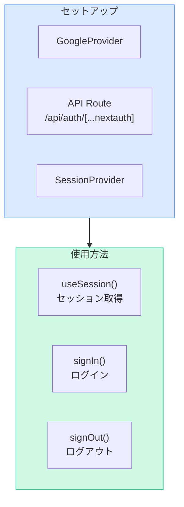
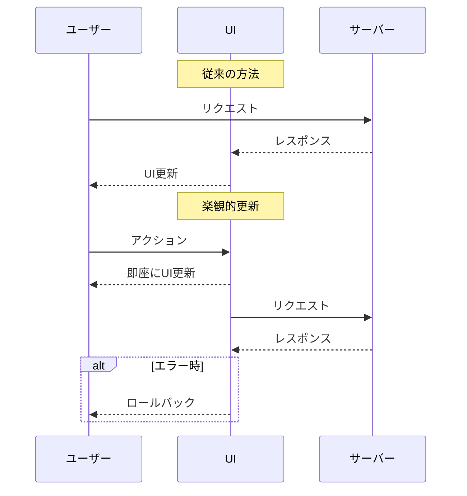
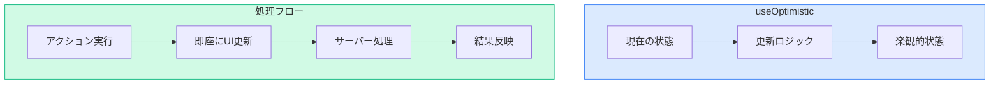
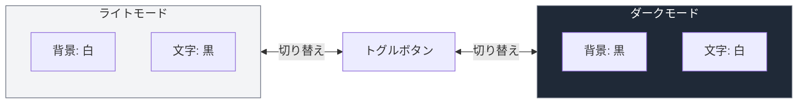
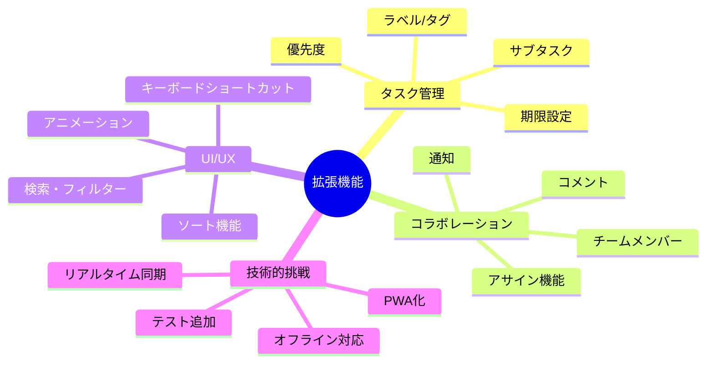

# 発展課題集（Optional）

> 必須編（Phase 1-4）を完了した人向けのチャレンジ課題です。
> 興味のあるものだけ取り組んでください。順番は問いません。

---

## 課題1: ドラッグ&ドロップでタスク移動

### 難易度: ★★★（やや難しい）

### 概要

dnd-kitを使って、タスクをドラッグ&ドロップでステータス間を移動できるようにします。



### 学べること

- dnd-kitの基本的な使い方
- ドラッグイベントのハンドリング
- 状態の更新とDB同期

### 実装手順

#### Step 1: dnd-kitをインストール

```bash
npm install @dnd-kit/core @dnd-kit/sortable @dnd-kit/utilities
```

#### Step 2: DndContextを設定

```tsx
// ファイルパス: components/TaskBoardClient.tsx
"use client";

import { useState } from "react";
import {
  DndContext,
  DragEndEvent,
  DragOverlay,
  DragStartEvent,
  PointerSensor,
  useSensor,
  useSensors,
} from "@dnd-kit/core";
import { useRouter } from "next/navigation";
import { Task, Status } from "@/types/task";
import { updateTaskStatus } from "@/lib/actions";
import TaskBoard from "./TaskBoard";
import TaskCard from "./TaskCard";
import AddTaskForm from "./AddTaskForm";

type Props = {
  initialTasks: Task[];
};

export default function TaskBoardClient({ initialTasks }: Props) {
  const router = useRouter();
  const [tasks, setTasks] = useState<Task[]>(initialTasks);
  const [activeTask, setActiveTask] = useState<Task | null>(null);

  const sensors = useSensors(
    useSensor(PointerSensor, {
      activationConstraint: {
        distance: 10,
      },
    })
  );

  const handleDragStart = (event: DragStartEvent) => {
    const task = tasks.find((t) => t.id === event.active.id);
    if (task) {
      setActiveTask(task);
    }
  };

  const handleDragEnd = async (event: DragEndEvent) => {
    const { active, over } = event;
    setActiveTask(null);

    if (!over) return;

    const taskId = active.id as string;
    const newStatus = over.id as Status;

    const task = tasks.find((t) => t.id === taskId);
    if (!task || task.status === newStatus) return;

    // 楽観的更新（UIを即座に更新）
    setTasks((prev) =>
      prev.map((t) => (t.id === taskId ? { ...t, status: newStatus } : t))
    );

    // DBを更新
    try {
      await updateTaskStatus(taskId, newStatus);
      router.refresh();
    } catch (error) {
      // エラー時はロールバック
      setTasks(initialTasks);
      alert("ステータスの更新に失敗しました");
    }
  };

  // ... 残りのコード（deleteTask等）

  return (
    <DndContext
      sensors={sensors}
      onDragStart={handleDragStart}
      onDragEnd={handleDragEnd}
    >
      <div>
        <div className="flex items-center justify-between mb-8">
          <h1 className="text-3xl font-bold text-gray-800">タスク一覧</h1>
          <AddTaskForm />
        </div>
        <TaskBoard tasks={tasks} />
      </div>
      <DragOverlay>
        {activeTask && <TaskCard task={activeTask} />}
      </DragOverlay>
    </DndContext>
  );
}
```

#### Step 3: ドロップ可能エリアを設定

```tsx
// ファイルパス: components/StatusColumn.tsx
"use client";

import { useDroppable } from "@dnd-kit/core";
import { Task, Status } from "@/types/task";
import DraggableTaskCard from "./DraggableTaskCard";

type Props = {
  status: Status;
  tasks: Task[];
};

// ... statusConfig は同じ

export default function StatusColumn({ status, tasks }: Props) {
  const { setNodeRef, isOver } = useDroppable({
    id: status,
  });

  const config = statusConfig[status];

  return (
    <div
      ref={setNodeRef}
      className={`${config.bgColor} ${config.borderColor} border rounded-lg p-4 min-h-[500px] transition-colors ${
        isOver ? "ring-2 ring-blue-400" : ""
      }`}
    >
      <div
        className={`${config.headerBg} ${config.headerText} px-3 py-2 rounded-md font-semibold mb-4 flex items-center justify-between`}
      >
        <span>{config.label}</span>
        <span className="text-sm font-normal">({tasks.length})</span>
      </div>
      <div className="space-y-3">
        {tasks.map((task) => (
          <DraggableTaskCard key={task.id} task={task} />
        ))}
      </div>
    </div>
  );
}
```

#### Step 4: ドラッグ可能なTaskCardを作成

```tsx
// ファイルパス: components/DraggableTaskCard.tsx
"use client";

import { useDraggable } from "@dnd-kit/core";
import { CSS } from "@dnd-kit/utilities";
import { Task } from "@/types/task";
import TaskCard from "./TaskCard";

type Props = {
  task: Task;
};

export default function DraggableTaskCard({ task }: Props) {
  const { attributes, listeners, setNodeRef, transform, isDragging } =
    useDraggable({
      id: task.id,
    });

  const style = {
    transform: CSS.Translate.toString(transform),
    opacity: isDragging ? 0.5 : 1,
  };

  return (
    <div ref={setNodeRef} style={style} {...listeners} {...attributes}>
      <TaskCard task={task} />
    </div>
  );
}
```

### ポイント解説



### つまずきポイント

```
エラー例: ドラッグできない
原因: "use client" がない、またはlisteners/attributesが適用されていない
解決法: Client Componentにして、{...listeners} {...attributes}を追加
```

```
エラー例: ドラッグ中の要素が表示されない
原因: DragOverlayが設定されていない
解決法: DndContext内にDragOverlayを追加
```

### 完成イメージ

タスクカードをドラッグして別のカラムにドロップすると、ステータスが自動更新されます。

---

## 課題2: NextAuth.jsで認証機能

### 難易度: ★★（普通）

### 概要

NextAuth.jsを使って、Googleログイン機能を追加します。



### 学べること

- NextAuth.jsの設定方法
- OAuth認証の仕組み
- セッション管理

### 実装手順

#### Step 1: NextAuth.jsをインストール

```bash
npm install next-auth
```

#### Step 2: 認証設定ファイルを作成

```tsx
// ファイルパス: lib/auth.ts

import { NextAuthOptions } from "next-auth";
import GoogleProvider from "next-auth/providers/google";

export const authOptions: NextAuthOptions = {
  providers: [
    GoogleProvider({
      clientId: process.env.GOOGLE_CLIENT_ID!,
      clientSecret: process.env.GOOGLE_CLIENT_SECRET!,
    }),
  ],
  pages: {
    signIn: "/login",
  },
};
```

#### Step 3: API Routeを作成

```tsx
// ファイルパス: app/api/auth/[...nextauth]/route.ts

import NextAuth from "next-auth";
import { authOptions } from "@/lib/auth";

const handler = NextAuth(authOptions);

export { handler as GET, handler as POST };
```

#### Step 4: 環境変数を設定

```bash
# .env.local
GOOGLE_CLIENT_ID=your_client_id
GOOGLE_CLIENT_SECRET=your_client_secret
NEXTAUTH_SECRET=your_random_secret
NEXTAUTH_URL=http://localhost:3000
```

#### Step 5: ログインボタンを追加

```tsx
// ファイルパス: components/AuthButton.tsx
"use client";

import { signIn, signOut, useSession } from "next-auth/react";

export default function AuthButton() {
  const { data: session, status } = useSession();

  if (status === "loading") {
    return <div>Loading...</div>;
  }

  if (session) {
    return (
      <div className="flex items-center gap-4">
        <span className="text-sm text-gray-600">
          {session.user?.name}
        </span>
        <button
          onClick={() => signOut()}
          className="text-sm text-gray-500 hover:text-gray-700"
        >
          ログアウト
        </button>
      </div>
    );
  }

  return (
    <button
      onClick={() => signIn("google")}
      className="bg-white border border-gray-300 px-4 py-2 rounded-lg hover:bg-gray-50 transition-colors"
    >
      Googleでログイン
    </button>
  );
}
```

#### Step 6: SessionProviderでラップ

```tsx
// ファイルパス: app/providers.tsx
"use client";

import { SessionProvider } from "next-auth/react";

export default function Providers({ children }: { children: React.ReactNode }) {
  return <SessionProvider>{children}</SessionProvider>;
}
```

```tsx
// ファイルパス: app/layout.tsx

import Providers from "./providers";

export default function RootLayout({ children }: { children: React.ReactNode }) {
  return (
    <html lang="ja">
      <body>
        <Providers>
          {/* ヘッダー等 */}
          {children}
        </Providers>
      </body>
    </html>
  );
}
```

### ポイント解説



### つまずきポイント

```
エラー例: "NEXTAUTH_SECRET is not set"
原因: 環境変数が設定されていない
解決法: .env.localにNEXTAUTH_SECRETを追加
```

```
エラー例: Google OAuth エラー
原因: Google Cloud Consoleの設定ミス
解決法: リダイレクトURIに http://localhost:3000/api/auth/callback/google を追加
```

---

## 課題3: 楽観的更新（Optimistic Updates）

### 難易度: ★★★（やや難しい）

### 概要

useOptimisticを使って、サーバー応答を待たずにUIを即座に更新します。



### 学べること

- useOptimisticフックの使い方
- 楽観的更新のパターン
- エラー時のロールバック

### 実装手順

#### Step 1: useOptimisticを使った削除

```tsx
// ファイルパス: components/TaskBoardClient.tsx
"use client";

import { useOptimistic, useTransition } from "react";
import { useRouter } from "next/navigation";
import { Task } from "@/types/task";
import { deleteTask } from "@/lib/actions";
import TaskBoard from "./TaskBoard";
import AddTaskForm from "./AddTaskForm";

type Props = {
  initialTasks: Task[];
};

type OptimisticAction =
  | { type: "delete"; taskId: string }
  | { type: "updateStatus"; taskId: string; status: string };

export default function TaskBoardClient({ initialTasks }: Props) {
  const router = useRouter();
  const [isPending, startTransition] = useTransition();

  const [optimisticTasks, addOptimisticUpdate] = useOptimistic(
    initialTasks,
    (state: Task[], action: OptimisticAction) => {
      switch (action.type) {
        case "delete":
          return state.filter((task) => task.id !== action.taskId);
        case "updateStatus":
          return state.map((task) =>
            task.id === action.taskId
              ? { ...task, status: action.status as Task["status"] }
              : task
          );
        default:
          return state;
      }
    }
  );

  const handleDeleteTask = async (taskId: string) => {
    if (!confirm("このタスクを削除しますか？")) return;

    startTransition(async () => {
      // 楽観的にUIを更新
      addOptimisticUpdate({ type: "delete", taskId });

      try {
        await deleteTask(taskId);
        router.refresh();
      } catch (error) {
        alert("削除に失敗しました");
        router.refresh(); // ロールバック
      }
    });
  };

  return (
    <div className={isPending ? "opacity-70" : ""}>
      <div className="flex items-center justify-between mb-8">
        <h1 className="text-3xl font-bold text-gray-800">タスク一覧</h1>
        <AddTaskForm />
      </div>
      <TaskBoard tasks={optimisticTasks} onDeleteTask={handleDeleteTask} />
    </div>
  );
}
```

### ポイント解説



- **`useOptimistic`**: 楽観的な状態を管理
- **`useTransition`**: 非同期処理中の状態を管理
- **ロールバック**: エラー時は`router.refresh()`で正しい状態に戻す

### つまずきポイント

```
エラー例: 楽観的更新が反映されない
原因: startTransition内で呼んでいない
解決法: addOptimisticUpdate を startTransition 内で呼ぶ
```

---

## 課題4: ダークモード対応

### 難易度: ★（簡単）

### 概要

CSS変数とTailwindを使って、ダークモードを実装します。



### 学べること

- Tailwind CSSのダークモード設定
- CSS変数の使い方
- ローカルストレージでの状態永続化

### 実装手順

#### Step 1: Tailwind設定を更新

```tsx
// ファイルパス: tailwind.config.ts

import type { Config } from "tailwindcss";

const config: Config = {
  darkMode: "class", // クラスベースのダークモード
  content: [
    "./pages/**/*.{js,ts,jsx,tsx,mdx}",
    "./components/**/*.{js,ts,jsx,tsx,mdx}",
    "./app/**/*.{js,ts,jsx,tsx,mdx}",
  ],
  theme: {
    extend: {},
  },
  plugins: [],
};

export default config;
```

#### Step 2: テーマ切り替えコンポーネントを作成

```tsx
// ファイルパス: components/ThemeToggle.tsx
"use client";

import { useEffect, useState } from "react";

export default function ThemeToggle() {
  const [isDark, setIsDark] = useState(false);

  useEffect(() => {
    // 初期値をローカルストレージから取得
    const savedTheme = localStorage.getItem("theme");
    const prefersDark = window.matchMedia("(prefers-color-scheme: dark)").matches;

    if (savedTheme === "dark" || (!savedTheme && prefersDark)) {
      setIsDark(true);
      document.documentElement.classList.add("dark");
    }
  }, []);

  const toggleTheme = () => {
    if (isDark) {
      document.documentElement.classList.remove("dark");
      localStorage.setItem("theme", "light");
    } else {
      document.documentElement.classList.add("dark");
      localStorage.setItem("theme", "dark");
    }
    setIsDark(!isDark);
  };

  return (
    <button
      onClick={toggleTheme}
      className="p-2 rounded-lg bg-gray-200 dark:bg-gray-700 hover:bg-gray-300 dark:hover:bg-gray-600 transition-colors"
      title={isDark ? "ライトモードに切り替え" : "ダークモードに切り替え"}
    >
      {isDark ? (
        <svg className="w-5 h-5 text-yellow-400" fill="currentColor" viewBox="0 0 20 20">
          <path
            fillRule="evenodd"
            d="M10 2a1 1 0 011 1v1a1 1 0 11-2 0V3a1 1 0 011-1zm4 8a4 4 0 11-8 0 4 4 0 018 0zm-.464 4.95l.707.707a1 1 0 001.414-1.414l-.707-.707a1 1 0 00-1.414 1.414zm2.12-10.607a1 1 0 010 1.414l-.706.707a1 1 0 11-1.414-1.414l.707-.707a1 1 0 011.414 0zM17 11a1 1 0 100-2h-1a1 1 0 100 2h1zm-7 4a1 1 0 011 1v1a1 1 0 11-2 0v-1a1 1 0 011-1zM5.05 6.464A1 1 0 106.465 5.05l-.708-.707a1 1 0 00-1.414 1.414l.707.707zm1.414 8.486l-.707.707a1 1 0 01-1.414-1.414l.707-.707a1 1 0 011.414 1.414zM4 11a1 1 0 100-2H3a1 1 0 000 2h1z"
            clipRule="evenodd"
          />
        </svg>
      ) : (
        <svg className="w-5 h-5 text-gray-700" fill="currentColor" viewBox="0 0 20 20">
          <path d="M17.293 13.293A8 8 0 016.707 2.707a8.001 8.001 0 1010.586 10.586z" />
        </svg>
      )}
    </button>
  );
}
```

#### Step 3: ダークモード対応のスタイルを追加

```tsx
// ファイルパス: app/layout.tsx

export default function RootLayout({ children }: { children: React.ReactNode }) {
  return (
    <html lang="ja">
      <body className="bg-gray-50 dark:bg-gray-900 text-gray-900 dark:text-gray-100 transition-colors">
        <header className="bg-white dark:bg-gray-800 shadow-sm border-b dark:border-gray-700">
          <div className="max-w-7xl mx-auto px-4 py-4 flex items-center justify-between">
            <a href="/" className="text-xl font-bold">
              Task Manager
            </a>
            <ThemeToggle />
          </div>
        </header>
        {children}
      </body>
    </html>
  );
}
```

#### Step 4: 各コンポーネントにダークモードスタイルを追加

```tsx
// 例: TaskCard.tsx
<div className="bg-white dark:bg-gray-800 p-4 rounded-lg shadow-sm border border-gray-200 dark:border-gray-700">
  <h3 className="font-medium text-gray-800 dark:text-gray-100">{task.title}</h3>
  <p className="mt-2 text-sm text-gray-500 dark:text-gray-400">
    {task.description}
  </p>
</div>
```

### ポイント解説

```mermaid
flowchart TB
    subgraph Tailwind["Tailwind ダークモード"]
        config["darkMode: 'class'"]
        class["html.dark"]
        prefix["dark:クラス名"]
    end

    subgraph Storage["状態管理"]
        localStorage["localStorage\n'theme'"]
        mediaQuery["prefers-color-scheme"]
    end

    config --> class
    class --> prefix
    Storage --> class

    style Tailwind fill:#dbeafe,stroke:#3b82f6
    style Storage fill:#fef3c7,stroke:#f59e0b
```

- **`dark:`プレフィックス**: ダークモード時のスタイルを指定
- **`localStorage`**: テーマ設定を永続化
- **`prefers-color-scheme`**: OSのダークモード設定を参照

### つまずきポイント

```
エラー例: ダークモードが適用されない
原因: tailwind.config.tsにdarkMode: "class"がない
解決法: 設定を追加して再起動
```

```
エラー例: ページリロード時にちらつく
原因: クライアントサイドでテーマを適用しているため
解決法: scriptタグでhtml要素に早期にクラスを追加
```

---

## 全課題クリア後

さらに挑戦したい人向けのアイデアです。

### 追加機能のアイデア



| 機能 | 難易度 | 学べること |
|------|--------|-----------|
| タスクの期限設定 | ★ | Date型の扱い、カレンダーUI |
| 優先度設定 | ★ | Enumの活用、ソート |
| チームメンバー管理 | ★★ | リレーション（Prisma） |
| コメント機能 | ★★ | 1対多のリレーション |
| リアルタイム同期 | ★★★ | WebSocket、Pusher |
| PWA化 | ★★ | Service Worker、manifest |
| E2Eテスト | ★★ | Playwright、Cypress |

### おすすめの学習リソース

- [Next.js公式ドキュメント](https://nextjs.org/docs)
- [Prisma公式ドキュメント](https://www.prisma.io/docs)
- [Tailwind CSS公式ドキュメント](https://tailwindcss.com/docs)
- [dnd-kit公式ドキュメント](https://dndkit.com/)
- [NextAuth.js公式ドキュメント](https://next-auth.js.org/)

---

おめでとうございます！ここまで到達したあなたは、Next.jsの基礎をしっかり身につけています。
ぜひ自分のアイデアでアプリを拡張してみてください！
