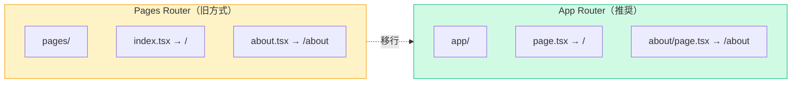
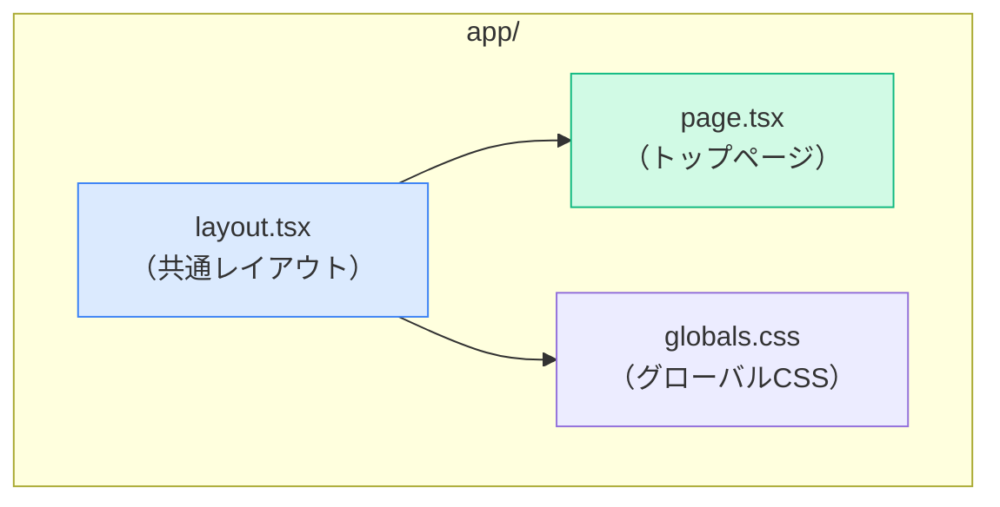
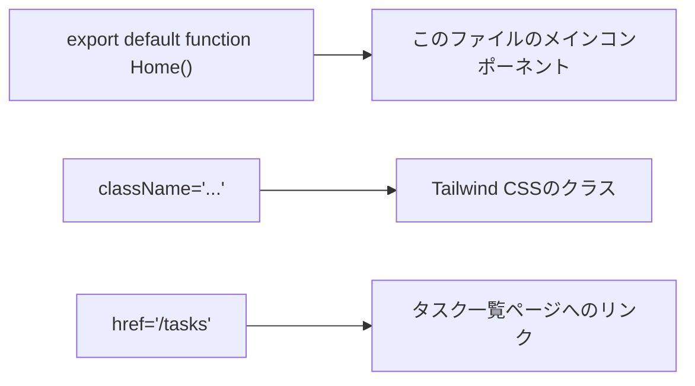
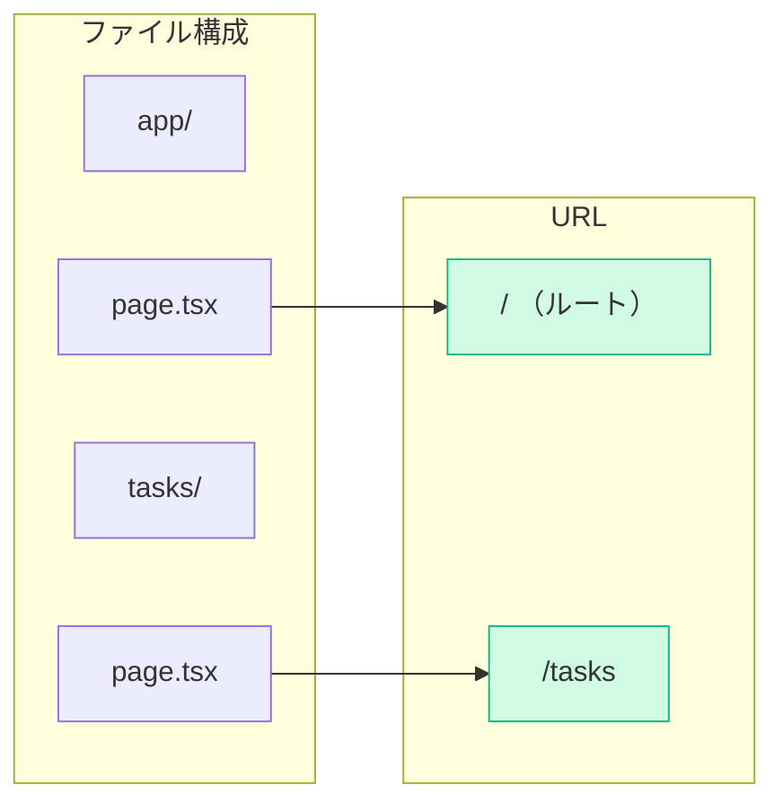
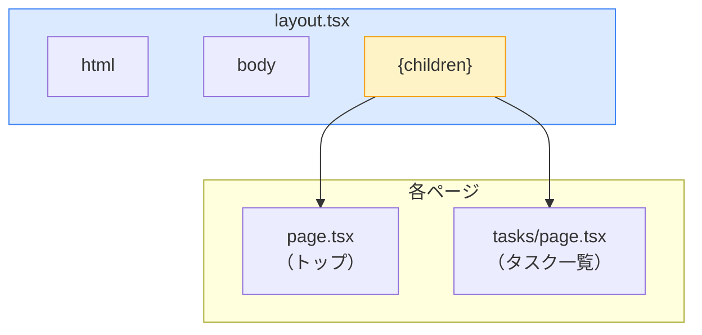
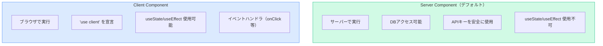
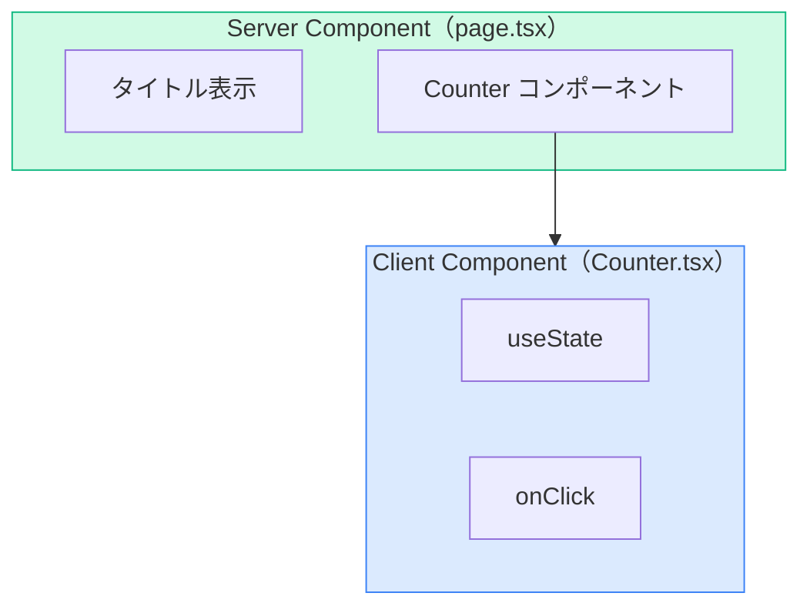
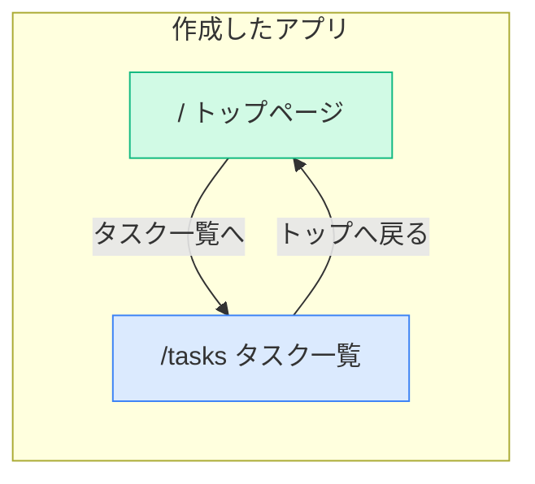

# Phase 1: 基礎編

## このPhaseの目標

- Next.js App Routerの仕組みを理解する
- ファイルベースルーティングでページを作成できる
- Server ComponentとClient Componentの違いを理解する
- layout.tsxで共通レイアウトを設定できる

## 事前に理解しておくこと

### App Router vs Pages Router

Next.jsには2つのルーティング方式があります。このロードマップでは**App Router**を使用します。



| 項目 | Pages Router | App Router |
|------|--------------|------------|
| ディレクトリ | `pages/` | `app/` |
| デフォルト | Client Component | Server Component |
| レイアウト | `_app.tsx` | `layout.tsx` |
| データ取得 | `getServerSideProps` | async/await |

---

## Step 1: プロジェクトの初期状態を確認する

### 学ぶこと

`create-next-app`で生成されたファイル構成を理解します。

### やること

- [ ] プロジェクトを作成（まだの場合）
- [ ] `app/`ディレクトリの構成を確認
- [ ] 開発サーバーを起動して初期画面を確認

### プロジェクト作成（まだの場合）

```bash
npx create-next-app@latest task-manager
cd task-manager
npm run dev
```

### 初期ファイル構成



### ポイント解説

| ファイル | 役割 |
|----------|------|
| `layout.tsx` | 全ページ共通のレイアウト（ヘッダー、フッターなど） |
| `page.tsx` | そのルートで表示されるページコンテンツ |
| `globals.css` | アプリ全体に適用されるCSS |

### 動作確認

http://localhost:3000 にアクセスして、Next.jsのウェルカムページが表示されればOK。

---

## Step 2: トップページを編集する

### 学ぶこと

`app/page.tsx`を編集して、オリジナルのトップページを作成します。

### やること

- [ ] `app/page.tsx`を編集
- [ ] 変更が即座に反映されることを確認（Hot Reload）

### コード例

```tsx
// ファイルパス: app/page.tsx

export default function Home() {
  return (
    <main className="min-h-screen p-8">
      <h1 className="text-4xl font-bold text-gray-800">
        Task Manager
      </h1>
      <p className="mt-4 text-gray-600">
        Jira風タスク管理ツールへようこそ
      </p>
      <a
        href="/tasks"
        className="mt-6 inline-block bg-blue-500 text-white px-6 py-2 rounded hover:bg-blue-600"
      >
        タスク一覧へ
      </a>
    </main>
  );
}
```

### ポイント解説



- **`export default`**: このファイルのメインコンポーネントを指定
- **Tailwind CSS**: `className`にユーティリティクラスを指定してスタイリング
  - `min-h-screen`: 最小高さを画面いっぱいに
  - `p-8`: padding 2rem
  - `text-4xl`: フォントサイズ 2.25rem
  - `font-bold`: 太字
  - `mt-4`: margin-top 1rem

### つまずきポイント

```
エラー例: "Module not found: Can't resolve '...'"
原因: インポートパスの誤り
解決法: ファイルパスが正しいか確認。相対パスは ./から始める
```

```
エラー例: Tailwindのスタイルが適用されない
原因: globals.cssがインポートされていない
解決法: layout.tsxで import './globals.css' があるか確認
```

### 動作確認

http://localhost:3000 にアクセスして、「Task Manager」のタイトルと「タスク一覧へ」ボタンが表示されればOK。

---

## Step 3: タスク一覧ページを作成する

### 学ぶこと

ファイルベースルーティングで新しいページを追加します。

### ルーティングの仕組み



### やること

- [ ] `app/tasks/`ディレクトリを作成
- [ ] `app/tasks/page.tsx`を作成

### コード例

```tsx
// ファイルパス: app/tasks/page.tsx

export default function TasksPage() {
  return (
    <main className="min-h-screen p-8">
      <h1 className="text-3xl font-bold text-gray-800">
        タスク一覧
      </h1>
      <p className="mt-4 text-gray-600">
        ここにカンバンボードが表示されます
      </p>
      <a
        href="/"
        className="mt-6 inline-block text-blue-500 hover:underline"
      >
        ← トップへ戻る
      </a>
    </main>
  );
}
```

### ポイント解説

- **フォルダ名 = URLパス**: `app/tasks/`フォルダを作ると`/tasks`でアクセス可能
- **page.tsx**: そのルートで表示されるコンテンツ（必須ファイル名）

### つまずきポイント

```
エラー例: 404 Not Found
原因: ファイル名が page.tsx ではない（例: tasks.tsx）
解決法: App Routerでは必ず page.tsx という名前にする
```

```
エラー例: フォルダを作ったのにページが表示されない
原因: フォルダ内に page.tsx がない
解決法: フォルダ内に page.tsx を作成する
```

### 動作確認

http://localhost:3000/tasks にアクセスして、「タスク一覧」のタイトルが表示されればOK。

---

## Step 4: レイアウトを設定する

### 学ぶこと

`layout.tsx`で全ページ共通のレイアウトを設定します。

### レイアウトの仕組み



### やること

- [ ] `app/layout.tsx`を編集してヘッダーを追加

### コード例

```tsx
// ファイルパス: app/layout.tsx

import type { Metadata } from "next";
import "./globals.css";

export const metadata: Metadata = {
  title: "Task Manager",
  description: "Jira風タスク管理ツール",
};

export default function RootLayout({
  children,
}: {
  children: React.ReactNode;
}) {
  return (
    <html lang="ja">
      <body className="bg-gray-50">
        <header className="bg-white shadow-sm border-b">
          <div className="max-w-7xl mx-auto px-4 py-4">
            <a href="/" className="text-xl font-bold text-gray-800">
              Task Manager
            </a>
          </div>
        </header>
        {children}
      </body>
    </html>
  );
}
```

### ポイント解説

- **`{children}`**: 各ページのコンテンツがここに挿入される
- **`metadata`**: ページのタイトルや説明を設定（SEO対策）
- **ネストされたレイアウト**: `app/tasks/layout.tsx`を作ると、タスクページ専用のレイアウトも追加可能

### つまずきポイント

```
エラー例: "Text content does not match server-rendered HTML"
原因: サーバーとクライアントでレンダリング結果が異なる
解決法: ブラウザ拡張機能が干渉している可能性。シークレットモードで確認
```

### 動作確認

どのページでも上部に「Task Manager」のヘッダーが表示されればOK。

---

## Step 5: Server ComponentとClient Componentを理解する

### 学ぶこと

Next.js App Routerの最も重要な概念である、Server ComponentとClient Componentの違いを理解します。

### 2つのコンポーネントの違い



| 項目 | Server Component | Client Component |
|------|------------------|------------------|
| 実行場所 | サーバー | ブラウザ |
| 宣言方法 | なし（デフォルト） | `"use client"` |
| useState | 使用不可 | 使用可能 |
| onClick | 使用不可 | 使用可能 |
| DB/APIアクセス | 直接可能 | fetch経由 |

### やること

- [ ] Client Componentを作成して違いを体験

### コード例: Server Component（デフォルト）

```tsx
// ファイルパス: app/tasks/page.tsx
// "use client" がないので Server Component

export default function TasksPage() {
  // これはサーバーで実行される
  console.log("このログはターミナルに表示される（サーバー）");

  return (
    <main className="min-h-screen p-8">
      <h1 className="text-3xl font-bold text-gray-800">
        タスク一覧
      </h1>
      <p className="mt-4 text-gray-600">
        ここにカンバンボードが表示されます
      </p>
      <a
        href="/"
        className="mt-6 inline-block text-blue-500 hover:underline"
      >
        ← トップへ戻る
      </a>
    </main>
  );
}
```

### コード例: Client Component

```tsx
// ファイルパス: components/Counter.tsx
"use client";

import { useState } from "react";

export default function Counter() {
  const [count, setCount] = useState(0);

  // これはブラウザで実行される
  console.log("このログはブラウザのコンソールに表示される");

  return (
    <div className="p-4 bg-white rounded shadow">
      <p className="text-lg">カウント: {count}</p>
      <button
        onClick={() => setCount(count + 1)}
        className="mt-2 bg-blue-500 text-white px-4 py-2 rounded hover:bg-blue-600"
      >
        +1
      </button>
    </div>
  );
}
```

### コンポーネントの組み合わせ



### ポイント解説

- **デフォルトはServer Component**: 何も書かなければサーバーで実行
- **`"use client"`**: ファイルの先頭に書くとClient Componentになる
- **使い分け**:
  - 静的な表示 → Server Component
  - インタラクション（クリック、入力） → Client Component

### つまずきポイント

```
エラー例: "useState is not defined" または "You're importing a component that needs useState"
原因: Server Componentで useState を使おうとしている
解決法: ファイルの先頭に "use client" を追加
```

```
エラー例: "Event handlers cannot be passed to Client Component props"
原因: Server ComponentでonClickを使おうとしている
解決法: イベントハンドラを使う部分をClient Componentに分離
```

### 動作確認

1. `components/`フォルダを作成
2. `components/Counter.tsx`を作成
3. `app/tasks/page.tsx`でCounterをインポートして使用

```tsx
// ファイルパス: app/tasks/page.tsx
import Counter from "@/components/Counter";

export default function TasksPage() {
  return (
    <main className="min-h-screen p-8">
      <h1 className="text-3xl font-bold text-gray-800">
        タスク一覧
      </h1>
      <div className="mt-6">
        <Counter />
      </div>
      <a
        href="/"
        className="mt-6 inline-block text-blue-500 hover:underline"
      >
        ← トップへ戻る
      </a>
    </main>
  );
}
```

ボタンをクリックしてカウントが増えればOK。

---

## Phase 1 完了チェックリスト

- [ ] `app/page.tsx`を編集してトップページを作成した
- [ ] `app/tasks/page.tsx`を作成してタスク一覧ページを追加した
- [ ] `app/layout.tsx`を編集して共通ヘッダーを追加した
- [ ] Server ComponentとClient Componentの違いを理解した
- [ ] `"use client"`の使い方を理解した
- [ ] `/`と`/tasks`でそれぞれ正しいページが表示される

## ここまでの成果



### 画面イメージ

**トップページ（/）**
- 「Task Manager」タイトル
- 「タスク一覧へ」ボタン

**タスク一覧ページ（/tasks）**
- 「タスク一覧」タイトル
- カウンターコンポーネント（Client Componentのテスト用）
- 「トップへ戻る」リンク

---

## 次のPhaseへ

Phase 2では、カンバンボードのUIを構築します。
- コンポーネント設計の考え方
- TaskCard, StatusColumn などのコンポーネント作成
- Tailwind CSSでのスタイリング

[Phase 2: UI構築編へ進む →](./phase2.md)
