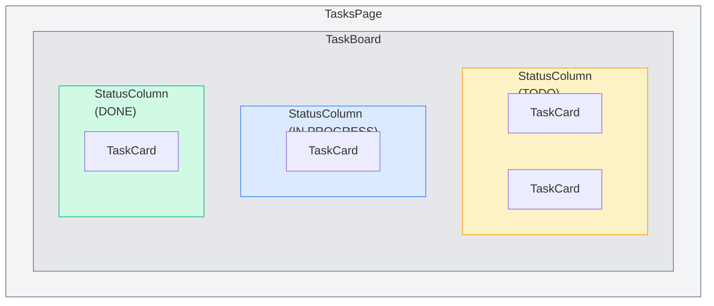
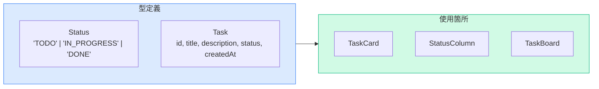
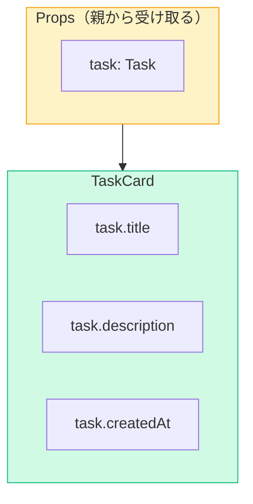
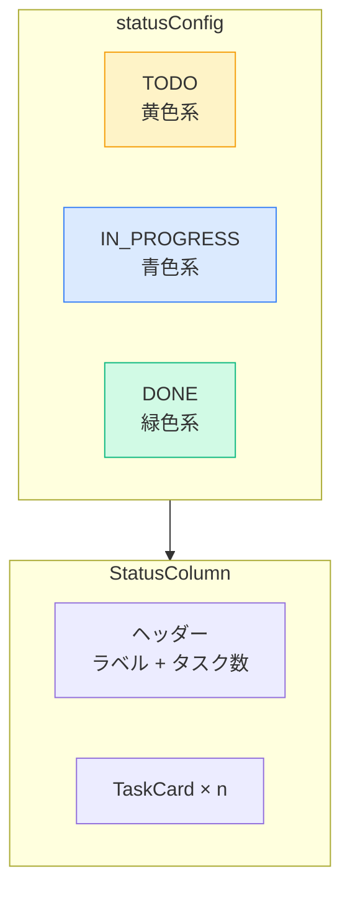
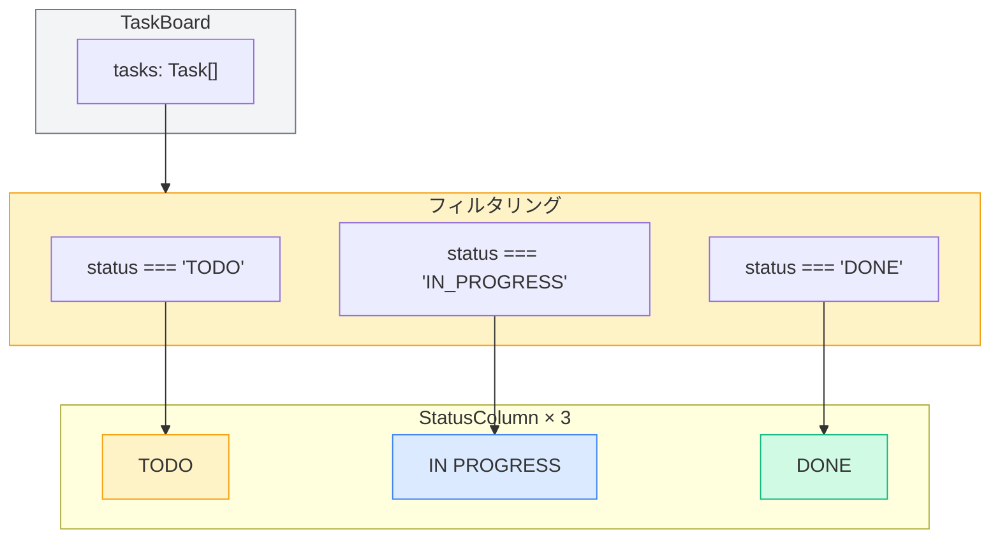
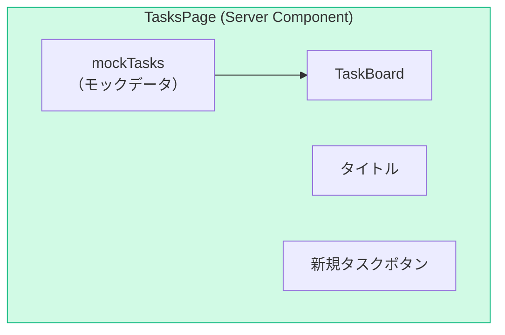
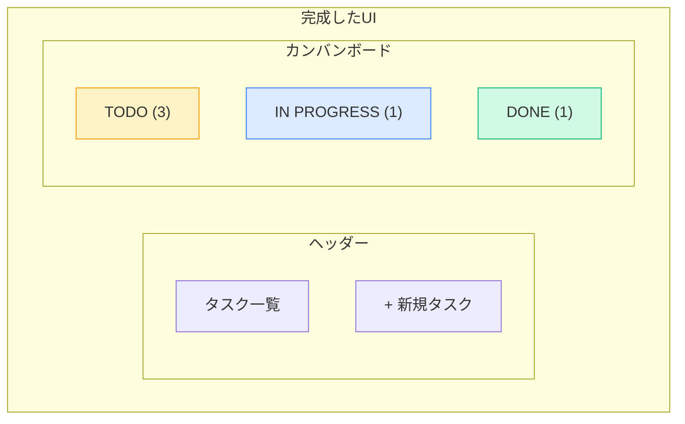
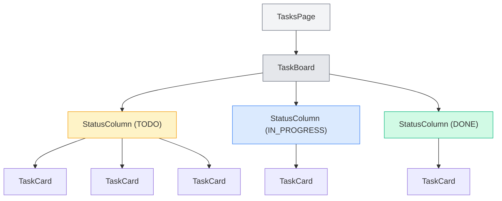

# Phase 2: UI構築編

## このPhaseの目標

- コンポーネント設計の考え方を理解する
- TypeScriptでPropsの型定義ができる
- Tailwind CSSでスタイリングできる
- モックデータを使ってカンバンボードUIを構築する

## 事前に理解しておくこと

### コンポーネント設計の考え方

UIを再利用可能な部品（コンポーネント）に分割します。



### 作成するコンポーネント一覧

| コンポーネント | 役割 | Props |
|----------------|------|-------|
| `TaskCard` | 1つのタスクを表示 | `task: Task` |
| `StatusColumn` | ステータス列（TODO等） | `status`, `tasks` |
| `TaskBoard` | カンバンボード全体 | `tasks` |

---

## Step 1: 型定義を作成する

### 学ぶこと

TypeScriptで型を定義し、コード全体で再利用します。

### やること

- [ ] `types/`ディレクトリを作成
- [ ] `types/task.ts`を作成

### コード例

```tsx
// ファイルパス: types/task.ts

export type Status = "TODO" | "IN_PROGRESS" | "DONE";

export type Task = {
  id: string;
  title: string;
  description: string;
  status: Status;
  createdAt: Date;
};
```

### ポイント解説



- **Union Type（`|`）**: `Status`は3つの値のいずれか
- **型エクスポート**: `export type`で他のファイルから使用可能に
- **型の再利用**: 1箇所で定義して複数箇所で使用

### つまずきポイント

```
エラー例: "Cannot find module '@/types/task'"
原因: パスエイリアスの設定ミス、またはファイルが存在しない
解決法: tsconfig.jsonの "paths" に "@/*" が設定されているか確認
```

### 動作確認

ファイルを保存してエラーが出なければOK。

---

## Step 2: モックデータを作成する

### 学ぶこと

開発中に使用するダミーデータを作成します。

### やること

- [ ] `lib/`ディレクトリを作成
- [ ] `lib/mock-data.ts`を作成

### コード例

```tsx
// ファイルパス: lib/mock-data.ts

import { Task } from "@/types/task";

export const mockTasks: Task[] = [
  {
    id: "1",
    title: "Next.jsプロジェクトのセットアップ",
    description: "create-next-appでプロジェクトを作成する",
    status: "DONE",
    createdAt: new Date("2024-01-01"),
  },
  {
    id: "2",
    title: "コンポーネント設計",
    description: "TaskCard, StatusColumnなどのコンポーネントを設計する",
    status: "IN_PROGRESS",
    createdAt: new Date("2024-01-02"),
  },
  {
    id: "3",
    title: "Prismaでデータベース構築",
    description: "SQLiteとPrismaを使ってDBを構築する",
    status: "TODO",
    createdAt: new Date("2024-01-03"),
  },
  {
    id: "4",
    title: "Server Actionsの実装",
    description: "CRUD操作をServer Actionsで実装する",
    status: "TODO",
    createdAt: new Date("2024-01-04"),
  },
  {
    id: "5",
    title: "Vercelにデプロイ",
    description: "完成したアプリをVercelにデプロイする",
    status: "TODO",
    createdAt: new Date("2024-01-05"),
  },
];
```

### ポイント解説

- **型の適用**: `Task[]`で配列の各要素が`Task`型であることを保証
- **モックデータの利点**: DBなしで開発を進められる

### 動作確認

インポートエラーが出なければOK。

---

## Step 3: TaskCardコンポーネントを作成する

### 学ぶこと

最小単位のコンポーネント「タスクカード」を作成します。

### やること

- [ ] `components/`ディレクトリを作成（まだの場合）
- [ ] `components/TaskCard.tsx`を作成

### コード例

```tsx
// ファイルパス: components/TaskCard.tsx

import { Task } from "@/types/task";

type Props = {
  task: Task;
};

export default function TaskCard({ task }: Props) {
  return (
    <div className="bg-white p-4 rounded-lg shadow-sm border border-gray-200 hover:shadow-md transition-shadow">
      <h3 className="font-medium text-gray-800">{task.title}</h3>
      <p className="mt-2 text-sm text-gray-500 line-clamp-2">
        {task.description}
      </p>
      <div className="mt-3 text-xs text-gray-400">
        {task.createdAt.toLocaleDateString("ja-JP")}
      </div>
    </div>
  );
}
```

### ポイント解説



- **Props型定義**: `type Props = { task: Task }`で受け取る値の型を定義
- **分割代入**: `{ task }`でPropsから`task`を取り出す
- **Tailwind CSS**:
  - `rounded-lg`: 角丸
  - `shadow-sm`: 小さい影
  - `hover:shadow-md`: ホバー時に影を大きく
  - `transition-shadow`: 影の変化をアニメーション
  - `line-clamp-2`: 2行で切り捨て

### つまずきポイント

```
エラー例: "Type '{ task: Task; }' is not assignable to type 'IntrinsicAttributes'"
原因: Propsの型定義が間違っている
解決法: Props型を正しく定義し、コンポーネントの引数に適用
```

```
エラー例: line-clamp-2 が効かない
原因: Tailwind CSSのline-clampプラグインが必要（v3.3以降は標準）
解決法: Tailwindのバージョンを確認、または @tailwindcss/line-clamp をインストール
```

### 動作確認

次のStepでStatusColumnに組み込んでから確認します。

---

## Step 4: StatusColumnコンポーネントを作成する

### 学ぶこと

ステータスごとのカラム（列）コンポーネントを作成します。

### やること

- [ ] `components/StatusColumn.tsx`を作成

### コード例

```tsx
// ファイルパス: components/StatusColumn.tsx

import { Task, Status } from "@/types/task";
import TaskCard from "./TaskCard";

type Props = {
  status: Status;
  tasks: Task[];
};

const statusConfig = {
  TODO: {
    label: "TODO",
    bgColor: "bg-amber-50",
    borderColor: "border-amber-200",
    headerBg: "bg-amber-100",
    headerText: "text-amber-800",
  },
  IN_PROGRESS: {
    label: "IN PROGRESS",
    bgColor: "bg-blue-50",
    borderColor: "border-blue-200",
    headerBg: "bg-blue-100",
    headerText: "text-blue-800",
  },
  DONE: {
    label: "DONE",
    bgColor: "bg-green-50",
    borderColor: "border-green-200",
    headerBg: "bg-green-100",
    headerText: "text-green-800",
  },
};

export default function StatusColumn({ status, tasks }: Props) {
  const config = statusConfig[status];

  return (
    <div
      className={`${config.bgColor} ${config.borderColor} border rounded-lg p-4 min-h-[500px]`}
    >
      <div
        className={`${config.headerBg} ${config.headerText} px-3 py-2 rounded-md font-semibold mb-4 flex items-center justify-between`}
      >
        <span>{config.label}</span>
        <span className="text-sm font-normal">({tasks.length})</span>
      </div>
      <div className="space-y-3">
        {tasks.map((task) => (
          <TaskCard key={task.id} task={task} />
        ))}
      </div>
    </div>
  );
}
```

### ポイント解説



- **設定オブジェクト**: `statusConfig`でステータスごとの色を管理
- **動的クラス**: テンプレートリテラルで条件に応じたクラスを適用
- **`.map()`**: 配列をループしてコンポーネントを生成
- **`key`属性**: Reactがリストの各要素を識別するために必要

### つまずきポイント

```
エラー例: "Each child in a list should have a unique 'key' prop"
原因: map()で生成した要素にkeyがない
解決法: <TaskCard key={task.id} ... /> のようにkeyを追加
```

### 動作確認

次のStepでTaskBoardに組み込んでから確認します。

---

## Step 5: TaskBoardコンポーネントを作成する

### 学ぶこと

カンバンボード全体のコンポーネントを作成します。

### やること

- [ ] `components/TaskBoard.tsx`を作成

### コード例

```tsx
// ファイルパス: components/TaskBoard.tsx

import { Task, Status } from "@/types/task";
import StatusColumn from "./StatusColumn";

type Props = {
  tasks: Task[];
};

const statuses: Status[] = ["TODO", "IN_PROGRESS", "DONE"];

export default function TaskBoard({ tasks }: Props) {
  return (
    <div className="grid grid-cols-1 md:grid-cols-3 gap-6">
      {statuses.map((status) => (
        <StatusColumn
          key={status}
          status={status}
          tasks={tasks.filter((task) => task.status === status)}
        />
      ))}
    </div>
  );
}
```

### ポイント解説



- **グリッドレイアウト**: `grid-cols-3`で3列に分割
- **レスポンシブ**: `md:grid-cols-3`で中サイズ以上で3列、それ以下で1列
- **`.filter()`**: ステータスでタスクを絞り込み

### つまずきポイント

```
エラー例: カラムが縦に並んでしまう
原因: 画面幅が狭い（md以下）
解決法: ブラウザの幅を広げるか、grid-cols-3からmd:を削除
```

### 動作確認

次のStepでページに組み込んでから確認します。

---

## Step 6: タスク一覧ページを更新する

### 学ぶこと

作成したコンポーネントをページに組み込みます。

### やること

- [ ] `app/tasks/page.tsx`を更新

### コード例

```tsx
// ファイルパス: app/tasks/page.tsx

import TaskBoard from "@/components/TaskBoard";
import { mockTasks } from "@/lib/mock-data";

export default function TasksPage() {
  return (
    <main className="min-h-screen p-8">
      <div className="max-w-7xl mx-auto">
        <div className="flex items-center justify-between mb-8">
          <h1 className="text-3xl font-bold text-gray-800">タスク一覧</h1>
          <button className="bg-blue-500 text-white px-4 py-2 rounded-lg hover:bg-blue-600 transition-colors">
            + 新規タスク
          </button>
        </div>
        <TaskBoard tasks={mockTasks} />
      </div>
    </main>
  );
}
```

### ポイント解説



- **Server Component**: `"use client"`がないのでサーバーで実行
- **データの流れ**: `mockTasks` → `TaskBoard` → `StatusColumn` → `TaskCard`

### つまずきポイント

```
エラー例: "Module not found: Can't resolve '@/components/TaskBoard'"
原因: パスが間違っている、またはファイルが存在しない
解決法: ファイルが正しい場所に存在するか確認
```

### 動作確認

http://localhost:3000/tasks にアクセスして、3列のカンバンボードが表示されればOK。

---

## Step 7: Counterコンポーネントを削除する

### 学ぶこと

Phase 1で作成したテスト用コンポーネントを整理します。

### やること

- [ ] `components/Counter.tsx`を削除（不要な場合）

Phase 1で作成したCounterコンポーネントはServer/Client Componentの理解のためのものだったので、不要であれば削除してください。

---

## Phase 2 完了チェックリスト

- [ ] `types/task.ts`で型定義を作成した
- [ ] `lib/mock-data.ts`でモックデータを作成した
- [ ] `components/TaskCard.tsx`を作成した
- [ ] `components/StatusColumn.tsx`を作成した
- [ ] `components/TaskBoard.tsx`を作成した
- [ ] `app/tasks/page.tsx`にTaskBoardを組み込んだ
- [ ] カンバンボードが3列で表示される
- [ ] 各ステータスに対応するタスクが表示される

## ここまでの成果



### コンポーネント構成



### 現時点のディレクトリ構成

```
task-manager/
├── app/
│   ├── layout.tsx
│   ├── page.tsx
│   ├── globals.css
│   └── tasks/
│       └── page.tsx        ← 更新
├── components/
│   ├── TaskCard.tsx        ← 新規
│   ├── StatusColumn.tsx    ← 新規
│   └── TaskBoard.tsx       ← 新規
├── lib/
│   └── mock-data.ts        ← 新規
└── types/
    └── task.ts             ← 新規
```

---

## 次のPhaseへ

Phase 3では、タスクの追加・削除機能を実装します。
- useStateでの状態管理
- フォームの作成
- Server Actionsの基礎

[Phase 3: データ操作編へ進む →](./phase3.md)
