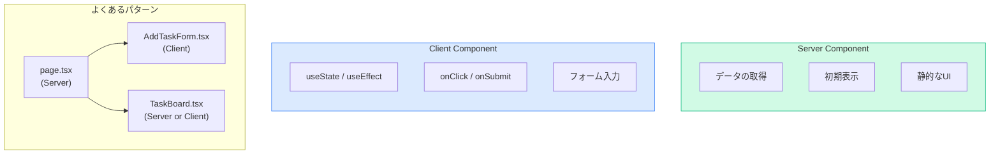
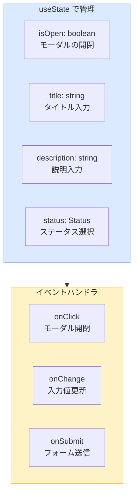
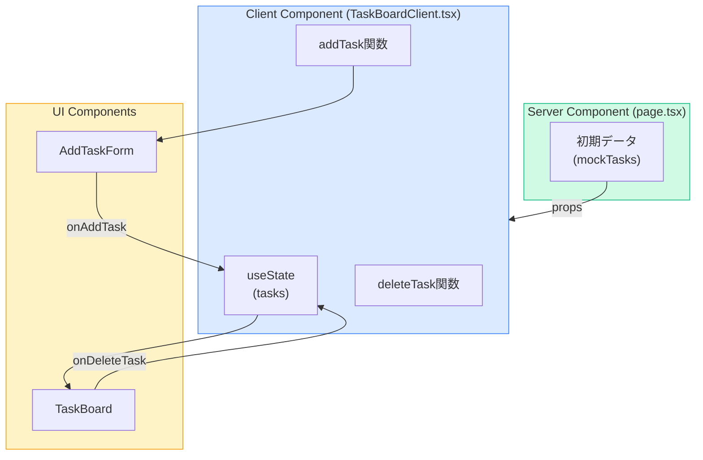
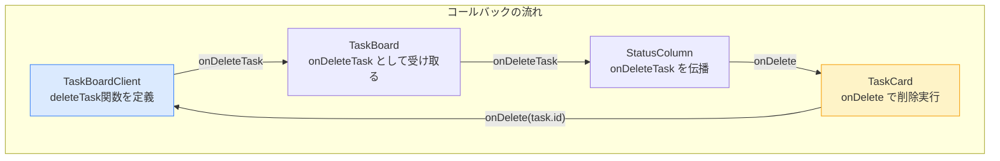
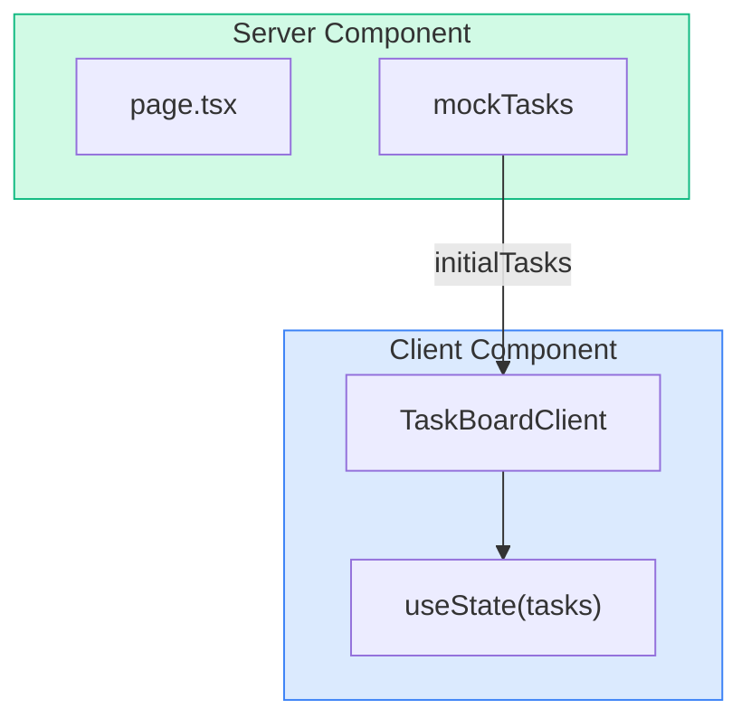
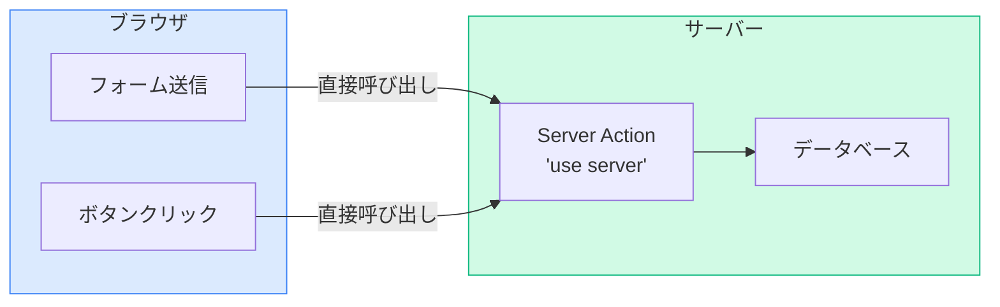
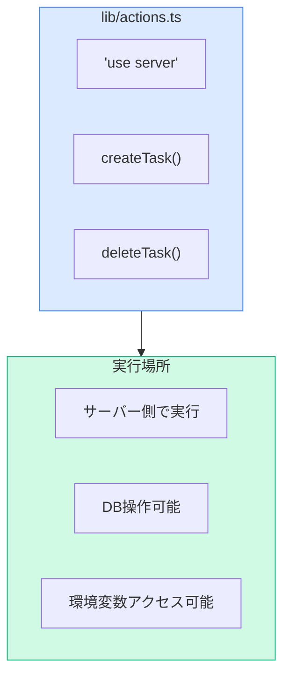
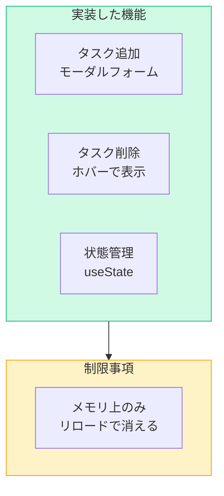

# Phase 3: データ操作編

## このPhaseの目標

- useStateでタスクの状態管理ができる
- フォームを作成してタスクを追加できる
- イベントハンドリング（onClick, onSubmit）を理解する
- Server Actionsの基礎を理解する

## 事前に理解しておくこと

### Client ComponentとServer Componentの使い分け



| 処理 | 適切なコンポーネント |
|------|---------------------|
| データ取得（DB/API） | Server Component |
| 静的な表示 | Server Component |
| フォーム入力 | Client Component |
| ボタンクリック | Client Component |
| 状態管理（useState） | Client Component |

---

## Step 1: タスク追加フォームを作成する

### 学ぶこと

Client Componentでフォームを作成し、useStateで入力値を管理します。

### やること

- [ ] `components/AddTaskForm.tsx`を作成

### コード例

```tsx
// ファイルパス: components/AddTaskForm.tsx
"use client";

import { useState } from "react";
import { Task, Status } from "@/types/task";

type Props = {
  onAddTask: (task: Omit<Task, "id" | "createdAt">) => void;
};

export default function AddTaskForm({ onAddTask }: Props) {
  const [isOpen, setIsOpen] = useState(false);
  const [title, setTitle] = useState("");
  const [description, setDescription] = useState("");
  const [status, setStatus] = useState<Status>("TODO");

  const handleSubmit = (e: React.FormEvent) => {
    e.preventDefault();

    if (!title.trim()) {
      alert("タイトルを入力してください");
      return;
    }

    onAddTask({
      title: title.trim(),
      description: description.trim(),
      status,
    });

    // フォームをリセット
    setTitle("");
    setDescription("");
    setStatus("TODO");
    setIsOpen(false);
  };

  if (!isOpen) {
    return (
      <button
        onClick={() => setIsOpen(true)}
        className="bg-blue-500 text-white px-4 py-2 rounded-lg hover:bg-blue-600 transition-colors"
      >
        + 新規タスク
      </button>
    );
  }

  return (
    <div className="fixed inset-0 bg-black bg-opacity-50 flex items-center justify-center z-50">
      <div className="bg-white rounded-lg p-6 w-full max-w-md">
        <h2 className="text-xl font-bold mb-4">新規タスク作成</h2>
        <form onSubmit={handleSubmit}>
          <div className="mb-4">
            <label className="block text-sm font-medium text-gray-700 mb-1">
              タイトル <span className="text-red-500">*</span>
            </label>
            <input
              type="text"
              value={title}
              onChange={(e) => setTitle(e.target.value)}
              className="w-full border border-gray-300 rounded-lg px-3 py-2 focus:outline-none focus:ring-2 focus:ring-blue-500"
              placeholder="タスクのタイトル"
              autoFocus
            />
          </div>
          <div className="mb-4">
            <label className="block text-sm font-medium text-gray-700 mb-1">
              説明
            </label>
            <textarea
              value={description}
              onChange={(e) => setDescription(e.target.value)}
              className="w-full border border-gray-300 rounded-lg px-3 py-2 focus:outline-none focus:ring-2 focus:ring-blue-500"
              rows={3}
              placeholder="タスクの説明（任意）"
            />
          </div>
          <div className="mb-6">
            <label className="block text-sm font-medium text-gray-700 mb-1">
              ステータス
            </label>
            <select
              value={status}
              onChange={(e) => setStatus(e.target.value as Status)}
              className="w-full border border-gray-300 rounded-lg px-3 py-2 focus:outline-none focus:ring-2 focus:ring-blue-500"
            >
              <option value="TODO">TODO</option>
              <option value="IN_PROGRESS">IN PROGRESS</option>
              <option value="DONE">DONE</option>
            </select>
          </div>
          <div className="flex gap-3">
            <button
              type="button"
              onClick={() => setIsOpen(false)}
              className="flex-1 px-4 py-2 border border-gray-300 rounded-lg hover:bg-gray-50 transition-colors"
            >
              キャンセル
            </button>
            <button
              type="submit"
              className="flex-1 px-4 py-2 bg-blue-500 text-white rounded-lg hover:bg-blue-600 transition-colors"
            >
              作成
            </button>
          </div>
        </form>
      </div>
    </div>
  );
}
```

### ポイント解説



- **`"use client"`**: ファイル先頭に必須（useState, onClickを使うため）
- **`useState`**: フォームの各入力値を管理
- **`e.preventDefault()`**: フォーム送信時のページリロードを防止
- **`Omit<Task, "id" | "createdAt">`**: Task型からid, createdAtを除いた型

### つまずきポイント

```
エラー例: "useState is not defined"
原因: "use client" が抜けている
解決法: ファイルの先頭に "use client" を追加
```

```
エラー例: フォーム送信後にページがリロードされる
原因: e.preventDefault() を呼んでいない
解決法: handleSubmit の最初で e.preventDefault() を呼ぶ
```

### 動作確認

次のStepで親コンポーネントに組み込んでから確認します。

---

## Step 2: 状態管理用のClient Componentを作成する

### 学ぶこと

タスクの状態管理を行うClient Componentを作成します。

### データフローの設計



### やること

- [ ] `components/TaskBoardClient.tsx`を作成

### コード例

```tsx
// ファイルパス: components/TaskBoardClient.tsx
"use client";

import { useState } from "react";
import { Task } from "@/types/task";
import TaskBoard from "./TaskBoard";
import AddTaskForm from "./AddTaskForm";

type Props = {
  initialTasks: Task[];
};

export default function TaskBoardClient({ initialTasks }: Props) {
  const [tasks, setTasks] = useState<Task[]>(initialTasks);

  const addTask = (newTask: Omit<Task, "id" | "createdAt">) => {
    const task: Task = {
      ...newTask,
      id: crypto.randomUUID(),
      createdAt: new Date(),
    };
    setTasks((prev) => [...prev, task]);
  };

  const deleteTask = (taskId: string) => {
    setTasks((prev) => prev.filter((task) => task.id !== taskId));
  };

  return (
    <div>
      <div className="flex items-center justify-between mb-8">
        <h1 className="text-3xl font-bold text-gray-800">タスク一覧</h1>
        <AddTaskForm onAddTask={addTask} />
      </div>
      <TaskBoard tasks={tasks} onDeleteTask={deleteTask} />
    </div>
  );
}
```

### ポイント解説

- **`initialTasks`**: サーバーから受け取る初期データ
- **`crypto.randomUUID()`**: ブラウザで一意のIDを生成
- **`setTasks((prev) => ...)`**: 前の状態を元に新しい状態を計算（推奨パターン）

### つまずきポイント

```
エラー例: "crypto is not defined"
原因: サーバーサイドで実行されている
解決法: "use client" があるか確認。なければ追加
```

---

## Step 3: TaskBoardに削除機能を追加する

### 学ぶこと

削除ボタンのコールバックを子コンポーネントに伝播させます。

### やること

- [ ] `components/TaskBoard.tsx`を更新
- [ ] `components/StatusColumn.tsx`を更新
- [ ] `components/TaskCard.tsx`を更新

### コード例: TaskBoard.tsx

```tsx
// ファイルパス: components/TaskBoard.tsx

import { Task, Status } from "@/types/task";
import StatusColumn from "./StatusColumn";

type Props = {
  tasks: Task[];
  onDeleteTask?: (taskId: string) => void;
};

const statuses: Status[] = ["TODO", "IN_PROGRESS", "DONE"];

export default function TaskBoard({ tasks, onDeleteTask }: Props) {
  return (
    <div className="grid grid-cols-1 md:grid-cols-3 gap-6">
      {statuses.map((status) => (
        <StatusColumn
          key={status}
          status={status}
          tasks={tasks.filter((task) => task.status === status)}
          onDeleteTask={onDeleteTask}
        />
      ))}
    </div>
  );
}
```

### コード例: StatusColumn.tsx

```tsx
// ファイルパス: components/StatusColumn.tsx

import { Task, Status } from "@/types/task";
import TaskCard from "./TaskCard";

type Props = {
  status: Status;
  tasks: Task[];
  onDeleteTask?: (taskId: string) => void;
};

const statusConfig = {
  TODO: {
    label: "TODO",
    bgColor: "bg-amber-50",
    borderColor: "border-amber-200",
    headerBg: "bg-amber-100",
    headerText: "text-amber-800",
  },
  IN_PROGRESS: {
    label: "IN PROGRESS",
    bgColor: "bg-blue-50",
    borderColor: "border-blue-200",
    headerBg: "bg-blue-100",
    headerText: "text-blue-800",
  },
  DONE: {
    label: "DONE",
    bgColor: "bg-green-50",
    borderColor: "border-green-200",
    headerBg: "bg-green-100",
    headerText: "text-green-800",
  },
};

export default function StatusColumn({ status, tasks, onDeleteTask }: Props) {
  const config = statusConfig[status];

  return (
    <div
      className={`${config.bgColor} ${config.borderColor} border rounded-lg p-4 min-h-[500px]`}
    >
      <div
        className={`${config.headerBg} ${config.headerText} px-3 py-2 rounded-md font-semibold mb-4 flex items-center justify-between`}
      >
        <span>{config.label}</span>
        <span className="text-sm font-normal">({tasks.length})</span>
      </div>
      <div className="space-y-3">
        {tasks.map((task) => (
          <TaskCard key={task.id} task={task} onDelete={onDeleteTask} />
        ))}
      </div>
    </div>
  );
}
```

### コード例: TaskCard.tsx

```tsx
// ファイルパス: components/TaskCard.tsx

import { Task } from "@/types/task";

type Props = {
  task: Task;
  onDelete?: (taskId: string) => void;
};

export default function TaskCard({ task, onDelete }: Props) {
  return (
    <div className="bg-white p-4 rounded-lg shadow-sm border border-gray-200 hover:shadow-md transition-shadow group">
      <div className="flex items-start justify-between">
        <h3 className="font-medium text-gray-800 flex-1">{task.title}</h3>
        {onDelete && (
          <button
            onClick={() => onDelete(task.id)}
            className="text-gray-400 hover:text-red-500 opacity-0 group-hover:opacity-100 transition-opacity ml-2"
            title="削除"
          >
            <svg
              xmlns="http://www.w3.org/2000/svg"
              className="h-5 w-5"
              viewBox="0 0 20 20"
              fill="currentColor"
            >
              <path
                fillRule="evenodd"
                d="M9 2a1 1 0 00-.894.553L7.382 4H4a1 1 0 000 2v10a2 2 0 002 2h8a2 2 0 002-2V6a1 1 0 100-2h-3.382l-.724-1.447A1 1 0 0011 2H9zM7 8a1 1 0 012 0v6a1 1 0 11-2 0V8zm5-1a1 1 0 00-1 1v6a1 1 0 102 0V8a1 1 0 00-1-1z"
                clipRule="evenodd"
              />
            </svg>
          </button>
        )}
      </div>
      <p className="mt-2 text-sm text-gray-500 line-clamp-2">
        {task.description}
      </p>
      <div className="mt-3 text-xs text-gray-400">
        {task.createdAt.toLocaleDateString("ja-JP")}
      </div>
    </div>
  );
}
```

### ポイント解説



- **Props Drilling**: コールバック関数を親から子へ渡す
- **オプショナルProps**: `onDelete?`で削除機能を任意に
- **`group`と`group-hover`**: 親要素ホバー時に子要素のスタイルを変更

---

## Step 4: タスク一覧ページを更新する

### 学ぶこと

Server ComponentとClient Componentを組み合わせます。

### やること

- [ ] `app/tasks/page.tsx`を更新

### コード例

```tsx
// ファイルパス: app/tasks/page.tsx

import TaskBoardClient from "@/components/TaskBoardClient";
import { mockTasks } from "@/lib/mock-data";

export default function TasksPage() {
  return (
    <main className="min-h-screen p-8">
      <div className="max-w-7xl mx-auto">
        <TaskBoardClient initialTasks={mockTasks} />
      </div>
    </main>
  );
}
```

### ポイント解説



- **Server Component（page.tsx）**: データを取得してClient Componentに渡す
- **Client Component（TaskBoardClient）**: 状態管理とインタラクション

### 動作確認

http://localhost:3000/tasks にアクセスして：
1. 「+ 新規タスク」ボタンをクリック
2. タイトルと説明を入力して「作成」
3. 新しいタスクが追加されることを確認
4. タスクカードにホバーして削除ボタンをクリック
5. タスクが削除されることを確認

---

## Step 5: Server Actionsの基礎を理解する

### 学ぶこと

Server Actionsの概念を理解し、Phase 4のDB連携に備えます。

### Server Actionsとは



| 従来の方法 | Server Actions |
|------------|----------------|
| API Routeを作成 | 関数を直接呼び出し |
| fetch()でPOST | 関数を実行 |
| エンドポイント管理 | 不要 |

### Server Actionsの書き方

```tsx
// ファイルパス: lib/actions.ts
"use server";

// この関数はサーバーで実行される
export async function createTask(formData: FormData) {
  const title = formData.get("title") as string;
  const description = formData.get("description") as string;

  // DBに保存する処理（Phase 4で実装）
  console.log("Creating task:", { title, description });

  // キャッシュを更新（Phase 4で実装）
  // revalidatePath("/tasks");
}

export async function deleteTask(taskId: string) {
  // DBから削除する処理（Phase 4で実装）
  console.log("Deleting task:", taskId);
}
```

### ポイント解説



- **`"use server"`**: ファイル先頭に記述するとすべての関数がServer Actionに
- **セキュリティ**: APIキーやDB接続情報をクライアントに露出しない
- **型安全**: TypeScriptで型チェック可能

### 現時点では

Phase 3ではメモリ上での状態管理のみ行います。
Phase 4でServer ActionsとPrismaを組み合わせてDBに永続化します。

---

## Phase 3 完了チェックリスト

- [ ] `components/AddTaskForm.tsx`を作成した
- [ ] `components/TaskBoardClient.tsx`を作成した
- [ ] `components/TaskCard.tsx`に削除ボタンを追加した
- [ ] タスクの追加ができる（モーダルフォーム）
- [ ] タスクの削除ができる（削除ボタン）
- [ ] Server Actionsの概念を理解した

## ここまでの成果



### 動作イメージ

1. **タスク追加**: 「+ 新規タスク」→ モーダル → 入力 → 作成
2. **タスク削除**: カードホバー → 削除ボタン → 削除

### 現時点のディレクトリ構成

```
task-manager/
├── app/
│   ├── layout.tsx
│   ├── page.tsx
│   ├── globals.css
│   └── tasks/
│       └── page.tsx            ← 更新
├── components/
│   ├── TaskCard.tsx            ← 更新
│   ├── StatusColumn.tsx        ← 更新
│   ├── TaskBoard.tsx           ← 更新
│   ├── TaskBoardClient.tsx     ← 新規
│   └── AddTaskForm.tsx         ← 新規
├── lib/
│   ├── mock-data.ts
│   └── actions.ts              ← 新規（準備のみ）
└── types/
    └── task.ts
```

---

## 次のPhaseへ

Phase 4では、Prismaを使ってDBに永続化します。
- Prismaのセットアップ
- Server ActionsでCRUD実装
- Vercelへのデプロイ

[Phase 4: 完成編へ進む →](./phase4.md)
