# Phase 4: 完成編

## このPhaseの目標

- Prismaをセットアップしてデータベースを構築する
- Server ActionsでCRUD操作を実装する
- revalidatePathでキャッシュを更新する
- Vercelにデプロイする

## 事前に理解しておくこと

### Prismaとは

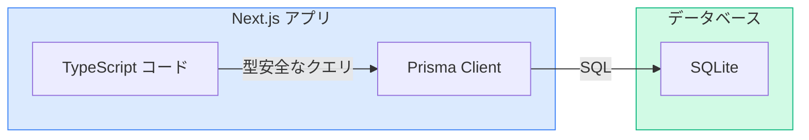

| 特徴 | 説明 |
|------|------|
| ORM | オブジェクトとDBテーブルをマッピング |
| 型安全 | TypeScriptと完全統合 |
| マイグレーション | スキーマ変更を管理 |
| 直感的なAPI | `prisma.task.create()` のような記法 |

---

## Step 1: Prismaをセットアップする

### 学ぶこと

Prismaをインストールし、SQLiteデータベースを設定します。

### やること

- [ ] Prismaをインストール
- [ ] Prismaを初期化
- [ ] スキーマを定義

### コマンド

```bash
# Prismaをインストール
npm install prisma @prisma/client

# Prismaを初期化（SQLiteを使用）
npx prisma init --datasource-provider sqlite
```

### 生成されるファイル

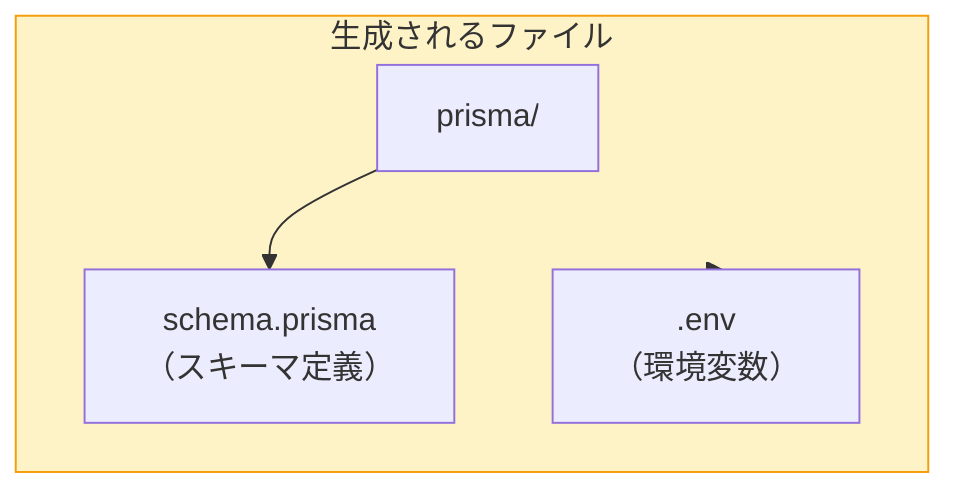

### スキーマを定義

```prisma
// ファイルパス: prisma/schema.prisma

generator client {
  provider = "prisma-client-js"
}

datasource db {
  provider = "sqlite"
  url      = env("DATABASE_URL")
}

model Task {
  id          String   @id @default(cuid())
  title       String
  description String   @default("")
  status      String   @default("TODO")
  createdAt   DateTime @default(now())
  updatedAt   DateTime @updatedAt
}
```

### ポイント解説

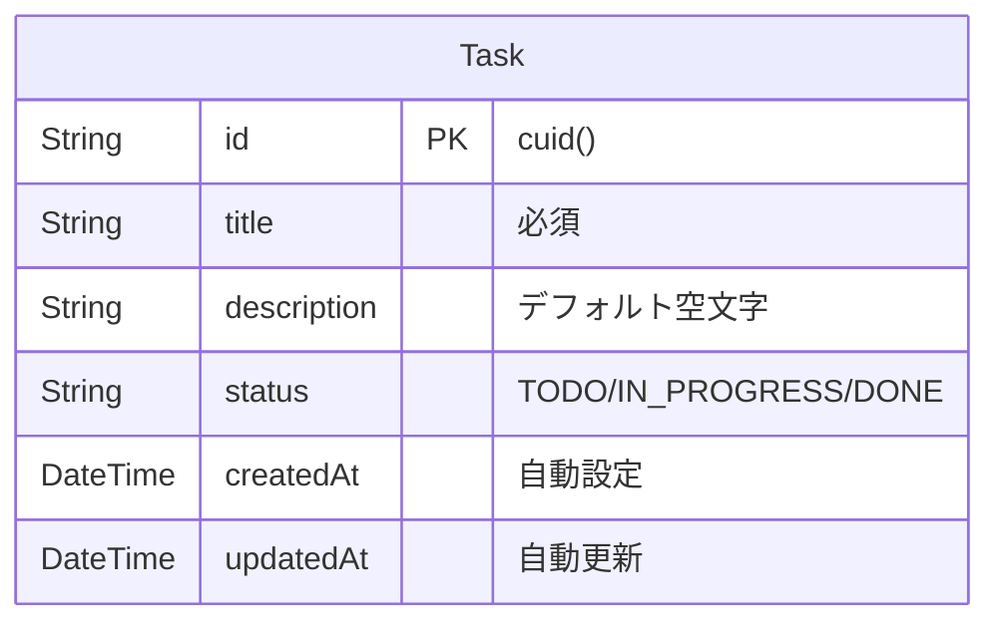

- **`@id`**: 主キー
- **`@default(cuid())`**: 一意のIDを自動生成
- **`@default(now())`**: 現在時刻を自動設定
- **`@updatedAt`**: 更新時に自動で時刻を更新

### つまずきポイント

```
エラー例: "prisma: command not found"
原因: Prismaがインストールされていない
解決法: npm install prisma を実行
```

### 動作確認

`prisma/schema.prisma`ファイルが作成されていればOK。

---

## Step 2: データベースを作成する

### 学ぶこと

スキーマからデータベースとPrisma Clientを生成します。

### やること

- [ ] マイグレーションを実行
- [ ] Prisma Clientを生成

### コマンド

```bash
# マイグレーションを実行（DBを作成）
npx prisma migrate dev --name init

# Prisma Clientを生成（型定義を更新）
npx prisma generate
```

### 実行結果

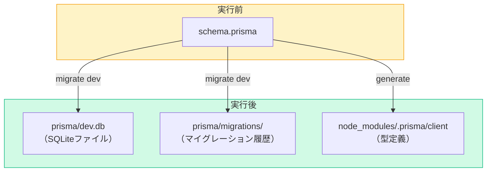

### ポイント解説

- **`migrate dev`**: 開発用のマイグレーション（テーブル作成）
- **`--name init`**: マイグレーション名（履歴管理用）
- **`generate`**: TypeScriptの型定義を生成

### つまずきポイント

```
エラー例: "Database does not exist"
原因: .envのDATABASE_URLが正しくない
解決法: .envファイルに DATABASE_URL="file:./dev.db" があるか確認
```

### 動作確認

`prisma/dev.db`ファイルが作成されていればOK。

---

## Step 3: Prisma Clientをセットアップする

### 学ぶこと

アプリケーションからPrismaを使うためのクライアントを設定します。

### やること

- [ ] `lib/prisma.ts`を作成

### コード例

```tsx
// ファイルパス: lib/prisma.ts

import { PrismaClient } from "@prisma/client";

const globalForPrisma = globalThis as unknown as {
  prisma: PrismaClient | undefined;
};

export const prisma = globalForPrisma.prisma ?? new PrismaClient();

if (process.env.NODE_ENV !== "production") {
  globalForPrisma.prisma = prisma;
}
```

### ポイント解説

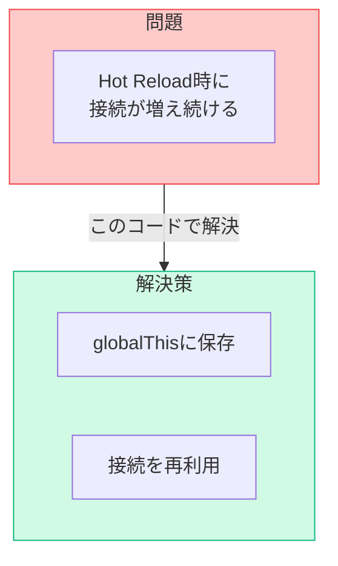

- **グローバル変数**: Hot Reload時にPrisma Clientが複数生成されるのを防止
- **シングルトンパターン**: 1つのインスタンスを再利用

### 動作確認

ファイルを保存してエラーが出なければOK。

---

## Step 4: Server Actionsを実装する

### 学ぶこと

Server ActionsでCRUD操作を実装します。

### データフロー

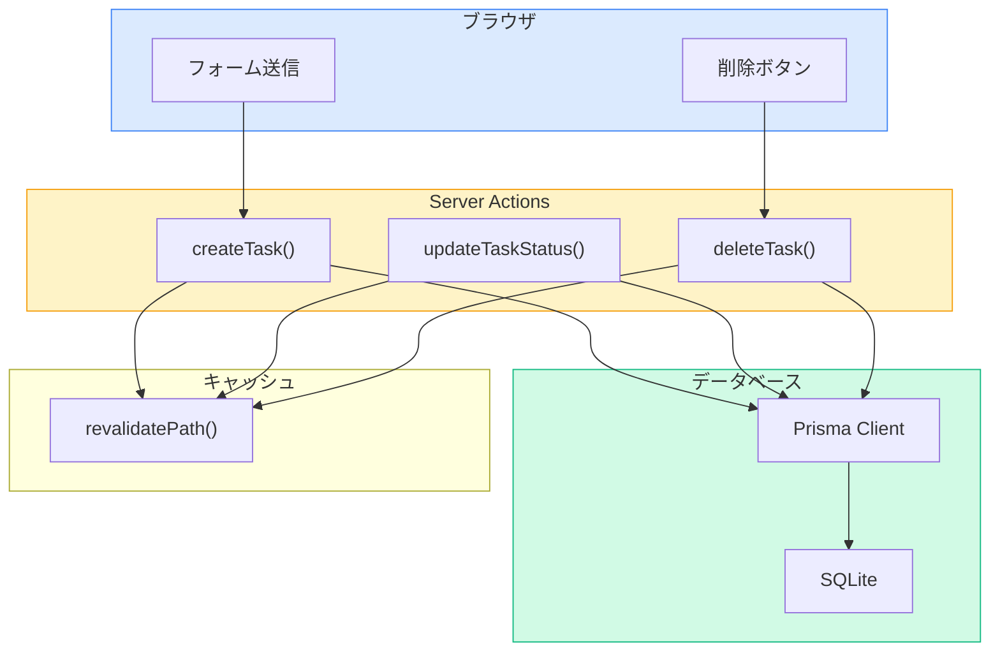

### やること

- [ ] `lib/actions.ts`を更新

### コード例

```tsx
// ファイルパス: lib/actions.ts
"use server";

import { revalidatePath } from "next/cache";
import { prisma } from "./prisma";
import { Status } from "@/types/task";

export async function getTasks() {
  const tasks = await prisma.task.findMany({
    orderBy: { createdAt: "desc" },
  });
  return tasks;
}

export async function createTask(formData: FormData) {
  const title = formData.get("title") as string;
  const description = (formData.get("description") as string) || "";
  const status = (formData.get("status") as Status) || "TODO";

  if (!title || !title.trim()) {
    throw new Error("タイトルは必須です");
  }

  await prisma.task.create({
    data: {
      title: title.trim(),
      description: description.trim(),
      status,
    },
  });

  revalidatePath("/tasks");
}

export async function updateTaskStatus(taskId: string, status: Status) {
  await prisma.task.update({
    where: { id: taskId },
    data: { status },
  });

  revalidatePath("/tasks");
}

export async function deleteTask(taskId: string) {
  await prisma.task.delete({
    where: { id: taskId },
  });

  revalidatePath("/tasks");
}
```

### ポイント解説

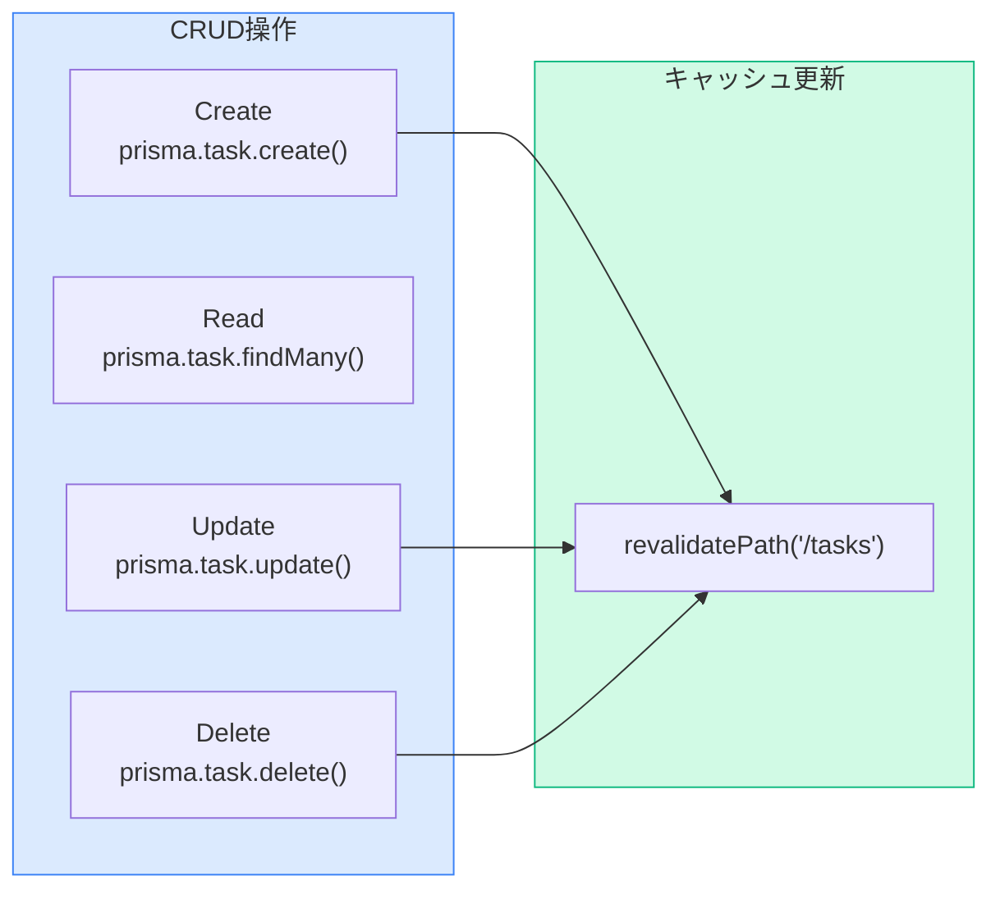

- **`revalidatePath()`**: 指定パスのキャッシュを無効化して再取得
- **Prisma API**:
  - `findMany()`: 全件取得
  - `create()`: 新規作成
  - `update()`: 更新
  - `delete()`: 削除

### つまずきポイント

```
エラー例: "PrismaClient is not defined"
原因: Prisma Clientがインポートされていない
解決法: import { prisma } from "./prisma" を確認
```

```
エラー例: "Record to update not found"
原因: 指定したIDのタスクが存在しない
解決法: taskIdが正しく渡されているか確認
```

---

## Step 5: コンポーネントをServer Actions対応に更新する

### 学ぶこと

コンポーネントをServer Actionsを使う形に更新します。

### やること

- [ ] `app/tasks/page.tsx`を更新
- [ ] `components/AddTaskForm.tsx`を更新
- [ ] `components/TaskBoardClient.tsx`を更新

### コード例: app/tasks/page.tsx

```tsx
// ファイルパス: app/tasks/page.tsx

import TaskBoardClient from "@/components/TaskBoardClient";
import { getTasks } from "@/lib/actions";

export default async function TasksPage() {
  const tasks = await getTasks();

  return (
    <main className="min-h-screen p-8">
      <div className="max-w-7xl mx-auto">
        <TaskBoardClient initialTasks={tasks} />
      </div>
    </main>
  );
}
```

### コード例: components/AddTaskForm.tsx

```tsx
// ファイルパス: components/AddTaskForm.tsx
"use client";

import { useState } from "react";
import { useRouter } from "next/navigation";
import { Status } from "@/types/task";
import { createTask } from "@/lib/actions";

export default function AddTaskForm() {
  const router = useRouter();
  const [isOpen, setIsOpen] = useState(false);
  const [isLoading, setIsLoading] = useState(false);

  const handleSubmit = async (e: React.FormEvent<HTMLFormElement>) => {
    e.preventDefault();
    setIsLoading(true);

    try {
      const formData = new FormData(e.currentTarget);
      await createTask(formData);
      setIsOpen(false);
      router.refresh();
    } catch (error) {
      alert("タスクの作成に失敗しました");
      console.error(error);
    } finally {
      setIsLoading(false);
    }
  };

  if (!isOpen) {
    return (
      <button
        onClick={() => setIsOpen(true)}
        className="bg-blue-500 text-white px-4 py-2 rounded-lg hover:bg-blue-600 transition-colors"
      >
        + 新規タスク
      </button>
    );
  }

  return (
    <div className="fixed inset-0 bg-black bg-opacity-50 flex items-center justify-center z-50">
      <div className="bg-white rounded-lg p-6 w-full max-w-md">
        <h2 className="text-xl font-bold mb-4">新規タスク作成</h2>
        <form onSubmit={handleSubmit}>
          <div className="mb-4">
            <label className="block text-sm font-medium text-gray-700 mb-1">
              タイトル <span className="text-red-500">*</span>
            </label>
            <input
              type="text"
              name="title"
              className="w-full border border-gray-300 rounded-lg px-3 py-2 focus:outline-none focus:ring-2 focus:ring-blue-500"
              placeholder="タスクのタイトル"
              required
              autoFocus
            />
          </div>
          <div className="mb-4">
            <label className="block text-sm font-medium text-gray-700 mb-1">
              説明
            </label>
            <textarea
              name="description"
              className="w-full border border-gray-300 rounded-lg px-3 py-2 focus:outline-none focus:ring-2 focus:ring-blue-500"
              rows={3}
              placeholder="タスクの説明（任意）"
            />
          </div>
          <div className="mb-6">
            <label className="block text-sm font-medium text-gray-700 mb-1">
              ステータス
            </label>
            <select
              name="status"
              defaultValue="TODO"
              className="w-full border border-gray-300 rounded-lg px-3 py-2 focus:outline-none focus:ring-2 focus:ring-blue-500"
            >
              <option value="TODO">TODO</option>
              <option value="IN_PROGRESS">IN PROGRESS</option>
              <option value="DONE">DONE</option>
            </select>
          </div>
          <div className="flex gap-3">
            <button
              type="button"
              onClick={() => setIsOpen(false)}
              className="flex-1 px-4 py-2 border border-gray-300 rounded-lg hover:bg-gray-50 transition-colors"
              disabled={isLoading}
            >
              キャンセル
            </button>
            <button
              type="submit"
              className="flex-1 px-4 py-2 bg-blue-500 text-white rounded-lg hover:bg-blue-600 transition-colors disabled:opacity-50"
              disabled={isLoading}
            >
              {isLoading ? "作成中..." : "作成"}
            </button>
          </div>
        </form>
      </div>
    </div>
  );
}
```

### コード例: components/TaskBoardClient.tsx

```tsx
// ファイルパス: components/TaskBoardClient.tsx
"use client";

import { useRouter } from "next/navigation";
import { Task } from "@/types/task";
import { deleteTask } from "@/lib/actions";
import TaskBoard from "./TaskBoard";
import AddTaskForm from "./AddTaskForm";

type Props = {
  initialTasks: Task[];
};

export default function TaskBoardClient({ initialTasks }: Props) {
  const router = useRouter();

  const handleDeleteTask = async (taskId: string) => {
    if (!confirm("このタスクを削除しますか？")) {
      return;
    }

    try {
      await deleteTask(taskId);
      router.refresh();
    } catch (error) {
      alert("タスクの削除に失敗しました");
      console.error(error);
    }
  };

  return (
    <div>
      <div className="flex items-center justify-between mb-8">
        <h1 className="text-3xl font-bold text-gray-800">タスク一覧</h1>
        <AddTaskForm />
      </div>
      <TaskBoard tasks={initialTasks} onDeleteTask={handleDeleteTask} />
    </div>
  );
}
```

### ポイント解説

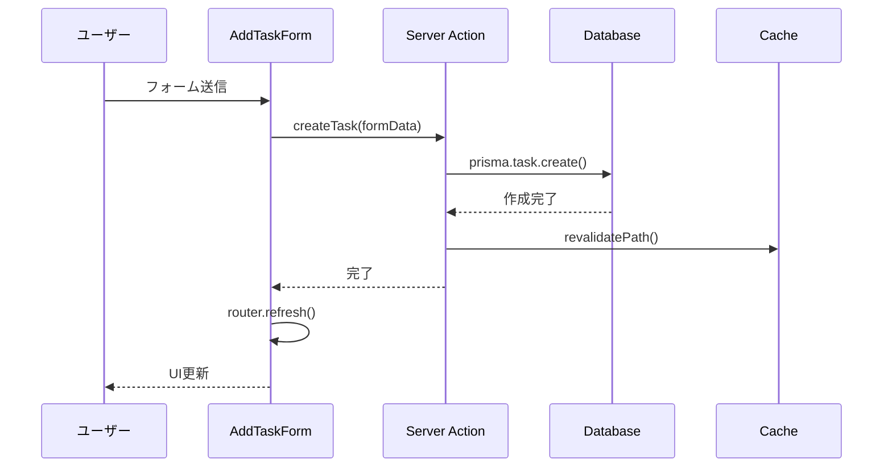

- **`FormData`**: フォームの値を自動で収集
- **`name`属性**: FormDataで値を取得するためのキー
- **`router.refresh()`**: サーバーから最新データを再取得
- **`isLoading`**: 送信中の二重送信を防止

### つまずきポイント

```
エラー例: フォーム送信後にデータが更新されない
原因: revalidatePath() が呼ばれていない、または router.refresh() がない
解決法: Server Actionで revalidatePath() を呼び、クライアントで router.refresh() を呼ぶ
```

```
エラー例: "Cannot read properties of undefined (reading 'id')"
原因: タスクのデータ型が合っていない（Dateがstring等）
解決法: Prismaから返るデータ型を確認。必要に応じて変換
```

### 動作確認

http://localhost:3000/tasks にアクセスして：
1. タスクを追加 → ページリロード後も残っている
2. タスクを削除 → ページリロード後も消えている

---

## Step 6: 型定義を更新する

### 学ぶこと

PrismaとTypeScriptの型を整合させます。

### やること

- [ ] `types/task.ts`を更新

### コード例

```tsx
// ファイルパス: types/task.ts

import { Task as PrismaTask } from "@prisma/client";

export type Status = "TODO" | "IN_PROGRESS" | "DONE";

// Prismaの型を再エクスポート（createdAt, updatedAtがDate型になる）
export type Task = PrismaTask;

// 新規作成時の型（id, createdAt, updatedAtは自動生成）
export type CreateTaskInput = {
  title: string;
  description?: string;
  status?: Status;
};
```

### ポイント解説

- **Prismaの型**: `@prisma/client`から自動生成される型を使用
- **型の一貫性**: アプリ全体で同じ型定義を使用

---

## Step 7: Vercelにデプロイする

### 学ぶこと

完成したアプリをVercelにデプロイします。

### デプロイの流れ

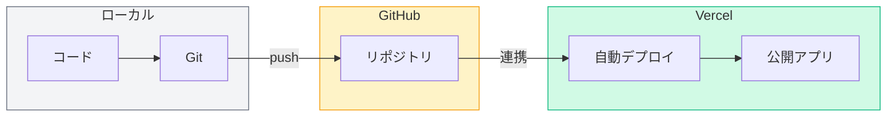

### やること

- [ ] GitHubリポジトリを作成
- [ ] コードをプッシュ
- [ ] Vercelでデプロイ

### 1. GitHubリポジトリを作成

```bash
# Gitリポジトリを初期化（まだの場合）
git init

# .gitignoreを確認（prisma/dev.dbが含まれていること）
cat .gitignore

# 変更をコミット
git add .
git commit -m "Initial commit: Task Manager app"

# GitHubでリポジトリを作成し、プッシュ
git remote add origin https://github.com/YOUR_USERNAME/task-manager.git
git branch -M main
git push -u origin main
```

### 2. Vercelでデプロイ

1. [Vercel](https://vercel.com) にアクセスしてログイン
2. 「Add New Project」をクリック
3. GitHubリポジトリを選択
4. 「Deploy」をクリック

### 3. 本番用データベースの設定

SQLiteはファイルベースのため、Vercelでは永続化されません。
本番環境では以下のオプションがあります：

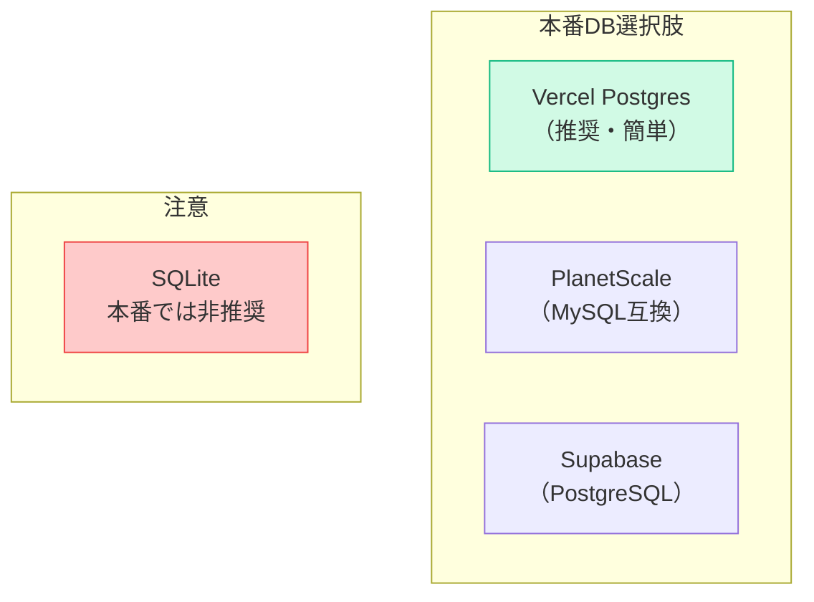

### Vercel Postgresを使う場合

1. Vercelダッシュボードで「Storage」タブを開く
2. 「Create Database」→「Postgres」を選択
3. 環境変数が自動設定される

4. `prisma/schema.prisma`を更新：

```prisma
datasource db {
  provider = "postgresql"
  url      = env("POSTGRES_PRISMA_URL")
  directUrl = env("POSTGRES_URL_NON_POOLING")
}
```

5. 再デプロイ

### つまずきポイント

```
エラー例: "PrismaClientInitializationError: Unable to require `prisma/client`"
原因: Prisma Clientがビルド時に生成されていない
解決法: package.jsonのpostinstallスクリプトを追加
```

```json
// package.json
{
  "scripts": {
    "postinstall": "prisma generate"
  }
}
```

```
エラー例: デプロイ後にデータが消える
原因: SQLiteファイルが永続化されない
解決法: Vercel Postgres等の外部DBを使用
```

### 動作確認

Vercelから提供されるURLにアクセスしてアプリが動作すればOK。

---

## Phase 4 完了チェックリスト

- [ ] Prismaをセットアップした
- [ ] スキーマを定義してマイグレーションを実行した
- [ ] Server ActionsでCRUD操作を実装した
- [ ] revalidatePathでキャッシュを更新している
- [ ] タスクがDBに永続化される（リロードしても残る）
- [ ] Vercelにデプロイした（任意）

## ここまでの成果

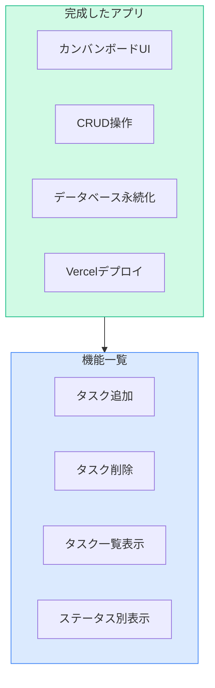

### 最終ディレクトリ構成

```
task-manager/
├── app/
│   ├── layout.tsx
│   ├── page.tsx
│   ├── globals.css
│   └── tasks/
│       └── page.tsx
├── components/
│   ├── TaskCard.tsx
│   ├── StatusColumn.tsx
│   ├── TaskBoard.tsx
│   ├── TaskBoardClient.tsx
│   └── AddTaskForm.tsx
├── lib/
│   ├── actions.ts          ← Server Actions
│   └── prisma.ts           ← Prisma Client
├── prisma/
│   ├── schema.prisma       ← DBスキーマ
│   ├── migrations/         ← マイグレーション履歴
│   └── dev.db              ← SQLiteファイル（開発用）
├── types/
│   └── task.ts
├── .env                    ← 環境変数
├── package.json
└── tsconfig.json
```

---

## おめでとうございます！

必須編（Phase 1-4）を完了しました。
これで、Next.js App Routerを使った基本的なCRUDアプリケーションが構築できるようになりました。

### 学んだこと

| Phase | 内容 |
|-------|------|
| 1 | App Router, ルーティング, SC/CC |
| 2 | コンポーネント設計, Props, Tailwind |
| 3 | useState, フォーム, イベント |
| 4 | Prisma, Server Actions, デプロイ |

### 次のステップ

さらにスキルアップしたい方は、発展課題に挑戦してみてください。

[発展課題集（Optional）へ進む →](./optional.md)
